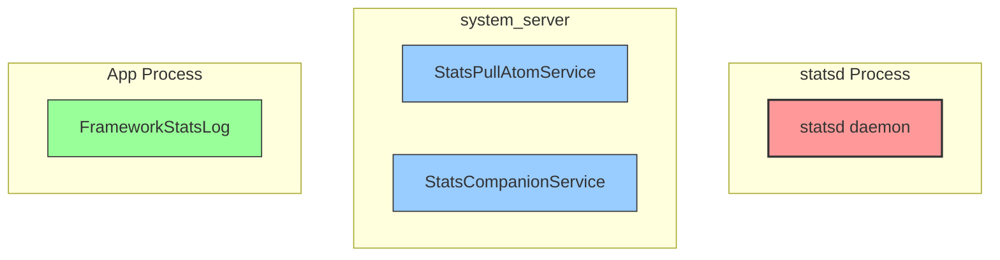

# StatsD 文档改善计划

> **创建日期**: 2026-08-23
> **目标**: 为初学者提供清晰的学习路径和丰富的可视化图表
> **当前版本**: V2.0 (已确认实施范围)

## ✅ 用户确认的设计决策

| 决策项 | 选择 | 说明 |
|--------|------|------|
| 快速入门形式 | **两者都要** | 独立快速入门文档 + Part1增加入门章节 |
| 文档语言 | **简体中文** | 符合当前项目语言习惯 |
| 图表呈现 | **Mermaid原生** | 零依赖，直接渲染 |
| 实施范围 | **全部重新整理** | 新增文档 + 重整Part1-Part8 |

---

## 📊 现状问题分析

| 问题类型 | 具体表现 | 影响程度 | 优先级 |
|---------|---------|---------|--------|
| **无学习路径** | 8个Part文档无阅读顺序建议，初学者不知从哪开始 | 🔴 高 | P0 |
| **无快速入门** | 缺少"5分钟上手"体验，初学者无法快速建立信心 | 🔴 高 | P0 |
| **概念图谱缺失** | Push/Pull/Atom/Matcher等核心概念无层级关系图 | 🔴 高 | P0 |
| **数据流不直观** | 虽有Mermaid图，但缺乏端到端的完整数据流可视化 | 🟡 中 | P1 |
| **类图分散** | 核心类图分布在不同文档中，缺乏统一视角 | 🟡 中 | P1 |
| **无调试指南** | 缺少如何验证/调试statsd的实战指引 | 🟡 中 | P1 |
| **功能模块图缺失** | 各组件职责边界无清晰的可视化对照 | 🟡 中 | P1 |

---

## 🎯 改善目标

### 核心目标
1. **降低学习曲线** - 让初学者能在30分钟内理解statsd全貌
2. **提供学习路径** - 创建清晰的概念掌握顺序
3. **丰富可视化** - 架构图、流程图、模块图、数据流图、类图一应俱全
4. **增强实用性** - 添加调试指南和实战案例

### 交付物清单

| 文档名称 | 类型 | 说明 | 优先级 |
|---------|------|------|--------|
| `StatsD-Quick-Start.md` | 入门指南 | 5分钟快速上手体验 | P0 |
| `StatsD-Learning-Path.md` | 学习导航 | 完整学习路径与概念顺序 | P0 |
| `StatsD-Concept-Map.md` | 概念图谱 | 核心概念的层级关系与依赖 | P0 |
| `StatsD-Architecture-Global.md` | 全局架构图 | 俯视角度的完整架构 | P1 |
| `StatsD-Debug-Guide.md` | 调试指南 | dumpsys/statsd命令实战 | P1 |
| `StatsD-Glossary.md` | 术语表 | 核心术语中英文对照 | P2 |

---

## 📐 文档结构设计 (学习路径)

### 学习路径 (Learning Path) - 双重入口

```
┌─────────────────────────────────────────────────────────────────────┐
│                        新手入口 (二选一)                             │
├─────────────────────────────────────────────────────────────────────┤
│                                                                     │
│  入口A: 独立快速入门                                                │
│  └── StatsD-Quick-Start.md  ──→  StatsD-Concept-Map.md             │
│                                                                     │
│  入口B: 集成快速入门 (Part1开头)                                    │
│  └── Part1-架构与边界 (新增入门章节) ──→ 继续Part1阅读              │
│                                                                     │
└─────────────────────────────────────────────────────────────────────┘
                                    ↓
                    ┌───────────────────────────────────┐
                    │     核心概念图谱 (必读)            │
                    │  StatsD-Concept-Map.md            │
                    │  - 概念层级金字塔                 │
                    │  - Push vs Pull 对比              │
                    │  - Atom/Metric/Alert 关系        │
                    └───────────────────────────────────┘
                                    ↓
                    ┌───────────────────────────────────┐
                    │     全局架构图 (推荐)             │
                    │  StatsD-Architecture-Global.md    │
                    │  - 多进程架构                     │
                    │  - 数据流总览                     │
                    │  - 通信机制                       │
                    └───────────────────────────────────┘
                                    ↓
                    ┌───────────────────────────────────┐
                    │     深入指南 (按需阅读)           │
                    │  Part1-Part8                      │
                    └───────────────────────────────────┘
                                    ↓
                    ┌───────────────────────────────────┐
                    │     调试实战 (实战参考)           │
                    │  StatsD-Debug-Guide.md            │
                    └───────────────────────────────────┘
```

---

## 📝 新增文档详细设计

### 1. StatsD-Quick-Start.md (快速入门) ⭐ P0

**目标读者**: 第一次接触statsd的开发者
**预计篇幅**: ~150行
**核心价值**: 5分钟建立整体认知，消除对statsd的陌生感

**内容大纲**:
```
1. 什么是StatsD？(一行话+生活类比)
   - 快递站比喻: Atom=包裹, statsd=分拣中心, Metric=报表
   
2. 5分钟快速体验
   - Step1: 查看statsd状态 (dumpsys statsd)
   - Step2: 查看支持的Atom (statsd list atoms)
   - Step3: 理解数据怎么产生的 (一个具体例子)
   
3. 核心概念速览 (配图)
   - Atom = 数据单元 (what happened)
   - Push = 主动上报 (App说: "我干了这事")
   - Pull = 定时拉取 (statsd问: "系统现在咋样")
   - Metric = 聚合指标 (把Atom加工成报表)
   
4. 术语对照表 (中英文)
5. 下一步学习建议 (链接到Concept-Map)
```

**关键图表**:
| 图表名 | 类型 | 说明 |
|--------|------|------|
| `statsd-analogy` | flowchart | 快递站生活类比 |
| `quick-experience-flow` | sequence | 5分钟体验流程 |
| `core-concept-layers` | mindmap | 核心概念层级速览 |

---

### 2. StatsD-Concept-Map.md (概念图谱) ⭐ P0

**目标读者**: 需要系统理解概念体系的开发者
**预计篇幅**: ~300行
**核心价值**: 建立完整的概念知识图谱，理解各概念间的依赖关系

**内容大纲**:
```
1. 概念层级金字塔
   - L1: 系统层 (StatsD System)
   - L2: 组件层 (daemon, services)
   - L3: 机制层 (push, pull)
   - L4: 数据层 (atom, metric, alert)
   - L5: 配置层 (config, matcher, condition)
   
2. 概念依赖有向图 (Mermaid)
   - Push数据流依赖链
   - Pull数据流依赖链
   - 配置生效依赖链
   
3. 核心概念对比表
   | 对比维度 | Push | Pull |
   |----------|------|------|
   | 发起方   | App/Framework | statsd |
   | 时机     | 事件触发 | 定时触发 |
   | 典型场景 | Wakelock获取 | CPU统计 |
   
4. 数据模型概念图
   - Atom → StatsEvent → LogEvent
   - Metric (8种类型)
   - Alert vs Alarm vs Condition
   
5. 完整术语表 (带源码路径)
```

**关键图表**:
| 图表名 | 类型 | 说明 |
|--------|------|------|
| `concept-hierarchy` | flowchart TB | 概念层级金字塔 |
| `concept-dependency` | graph LR | 概念依赖有向图 |
| `push-vs-pull-comparison` | table | Push/Pull对比表 |
| `data-model-hierarchy` | classDiagram | 数据模型类图 |

---

### 3. StatsD-Learning-Path.md (学习导航)

**目标读者**: 不知道从哪开始学习的开发者
**预计篇幅**: ~100行
**核心价值**: 提供清晰的学习顺序和每个阶段的目标

**内容大纲**:
```
1. 学习路径总览图 (Mermaid)
2. 各阶段学习目标
   - 阶段1: 建立感觉 (30分钟)
   - 阶段2: 理解架构 (1小时)
   - 阶段3: 掌握机制 (2小时)
   - 阶段4: 深入实现 (4小时)
   - 阶段5: 实战调试 (持续)
   
3. 每阶段的推荐文档
4. 学习效果自测清单
```

---

### 4. StatsD-Glossary.md (术语表)

**目标读者**: 需要查阅术语定义的开发者
**预计篇幅**: ~200行

**内容大纲**:
```
1. 核心术语 (A-Z排序)
   - Atom, AtomMatcher, Alert, Alarm
   - Config, Condition, Metric
   - Pull, Push
2. 系统组件术语
3. 源码路径对照
```

---

## 🎨 图表设计规范

### 统一配色方案

| 进程类型 | 填充色 | 边框色 | 含义 |
|---------|--------|--------|------|
| **statsd 独立进程** | `#ff9999` (浅红) | `#333` | Native Daemon核心 |
| **system_server** | `#99ccff` (浅蓝) | `#333` | Java服务层 |
| **App Process** | `#99ff99` (浅绿) | `#333` | 应用层 |
| **logd Process** | `#ffcc99` (浅橙) | `#333` | 日志系统 |
| **配置/元数据** | `#e1bee7` (浅紫) | `#333` | 配置相关 |

### Mermaid 颜色应用示例



### 箭头语义统一

| 箭头类型 | 含义 | 示例 |
|---------|------|------|
| `-->` | 同步调用/数据流 | `App --> FrameworkStatsLog` |
| `-.->` | 异步回调 | `statsd -.-> PullReceiver` |
| `==>` | 定时触发 | `PullScheduler ==> Puller` |
| `--\|` | 权限/控制 | `Binder IPC` |
| `o--o` | 状态变化 | `Active o--o Inactive` |

### 图表类型命名规范

| 图表类型 | 命名模式 | 示例 |
|---------|---------|------|
| 架构图 | `{Area}-Architecture` | `statsd-Architecture` |
| 流程图 | `{Process}-Flow` | `Push-Data-Flow` |
| 时序图 | `{Scenario}-Sequence` | `Atom-Push-Sequence` |
| 类图 | `{Module}-Class-Diagram` | `StatsEvent-Class-Diagram` |
| 状态图 | `{Entity}-State-Machine` | `Wakelock-State-Machine` |
| 组件图 | `{System}-Components` | `statsd-System-Components` |

### 必做图表清单

**Quick-Start 文档**:
- [ ] `statsd-express-analogy` - 快递站生活类比图
- [ ] `quick-command-flow` - 5分钟命令体验流程
- [ ] `core-concept-layers` - 核心概念速览

**Concept-Map 文档**:
- [ ] `concept-hierarchy-pyramid` - 概念层级金字塔
- [ ] `concept-dependency-graph` - 概念依赖有向图
- [ ] `push-pull-comparison` - Push vs Pull对比表
- [ ] `atom-to-metric-flow` - Atom到Metric加工流程
- [ ] `data-model-uml` - 数据模型类图

**Architecture-Global 文档**:
- [ ] `system-wide-arch` - 系统全景架构图
- [ ] `multi-process-data-flow` - 多进程数据流图
- [ ] `comm-mechanisms` - 通信机制总览
- [ ] `push-full-sequence` - Push完整时序图
- [ ] `pull-full-sequence` - Pull完整时序图

**Debug-Guide 文档**:
- [ ] `debug-workflow` - 调试工作流图
- [ ] `troubleshooting-tree` - 问题排查决策树

---

## 📋 实施计划 (Phase 1: 入门与概念)

### 任务列表

| # | 任务 | 优先级 | 依赖 | 说明 |
|---|------|--------|------|------|
| 1 | 创建 `StatsD-Quick-Start.md` | P0 | - | 5分钟快速上手 |
| 2 | 创建 `StatsD-Concept-Map.md` | P0 | 1 | 概念层级关系图 |
| 3 | 创建 `StatsD-Learning-Path.md` | P0 | 2 | 完整学习导航 |
| 4 | 更新 Part1 开头增加入门章节 | P0 | 1,2 | 双重入口 |
| 5 | 创建 `StatsD-Glossary.md` | P1 | 2 | 术语表 |

## 📋 实施计划 (Phase 2: 架构与调试)

| # | 任务 | 优先级 | 依赖 | 说明 |
|---|------|--------|------|------|
| 6 | 创建 `StatsD-Architecture-Global.md` | P1 | Phase1 | 全局架构图 |
| 7 | 创建 `StatsD-Debug-Guide.md` | P1 | 6 | 调试指南 |
| 8 | 重整 Part2-Part8 结构和图表 | P1 | 6 | 优化现有文档 |

## 📋 实施计划 (Phase 3: 整合与验证)

| # | 任务 | 优先级 | 依赖 | 说明 |
|---|------|--------|------|------|
| 9 | 创建文档索引页面 | P2 | Phase1+2 | 总览入口 |
| 10 | 验证所有Mermaid图表 | P2 | - | 语法检查 |
| 11 | 添加交叉引用链接 | P2 | - | 文档互联 |

---

## ✅ 验收标准

### 文档质量标准
- [ ] 所有Mermaid图表语法正确，无中文标签（遵守Mermaid规范）
- [ ] 每个核心概念有对应的可视化图表
- [ ] 所有源码引用带有行号 `[来源: ~/aosp/base/xxx.java:123 实测]`
- [ ] 所有结论带有"硬性事实清单"小节

### 学习体验标准
- [ ] 初学者可在5分钟内完成快速入门（Quick-Start）
- [ ] 学习路径文档覆盖100%的核心概念
- [ ] 每个Phase都有清晰的下一步指引
- [ ] 术语表覆盖所有专业术语的中英文对照

### 技术标准
- [ ] 所有图表符合Mermaid规范（无中文标签、无圆括号）
- [ ] 所有文档使用Markdown格式
- [ ] 图片使用Mermaid原生语法（不使用外部图片）
- [ ] 图表颜色符合统一配色方案

---

## 📝 附录

### A. 核心概念清单 (待图表化)

| 概念 | 英文 | 分类 | 优先级 | 图表 |
|------|------|------|--------|------|
| 原子事件 | Atom | 数据单元 | P0 | `atom-structure` |
| 推送 | Push | 传输机制 | P0 | `push-flow` |
| 拉取 | Pull | 传输机制 | P0 | `pull-flow` |
| 指标 | Metric | 数据聚合 | P0 | `metric-types` |
| 匹配器 | AtomMatcher | 规则引擎 | P1 | `matcher-logic` |
| 条件 | Condition | 状态判断 | P1 | `condition-eval` |
| 告警 | Alert | 异常检测 | P1 | `alert-trigger` |
| 配置 | StatsdConfig | 系统配置 | P1 | `config-flow` |

### B. 现有文档清单

| 文档 | 位置 | 状态 |
|------|------|------|
| Statsd-Framework-Analysis.md | exploration/ | 基础分析 |
| Statsd-Framework-V2.md | exploration/ | V2增强版 |
| StatsD-Guide-V2-Part1.md | exploration/ | 架构与边界 |
| StatsD-Guide-V2-Part2.md | exploration/ | 写入路径 |
| StatsD-Guide-V2-Part3.md | exploration/ | 守护进程与匹配器 |
| StatsD-Guide-V2-Part4.md | exploration/ | 条件与状态 |
| StatsD-Guide-V2-Part5.md | exploration/ | 八种指标 |
| StatsD-Guide-V2-Part6.md | exploration/ | 配置与告警 |
| StatsD-Guide-V2-Part7.md | exploration/ | 拉取与基础设施 |
| StatsD-Guide-V2-Part8.md | exploration/ | 边界测试与实战 |

### C. 新增文档清单

| 文档 | 优先级 | 状态 |
|------|--------|------|
| StatsD-Quick-Start.md | P0 | 待创建 |
| StatsD-Concept-Map.md | P0 | 待创建 |
| StatsD-Learning-Path.md | P0 | 待创建 |
| StatsD-Glossary.md | P1 | 待创建 |
| StatsD-Architecture-Global.md | P1 | 待创建 |
| StatsD-Debug-Guide.md | P1 | 待创建 |

---

*计划版本: V2.0 | 最后更新: 2026-08-23 | 状态: 待用户确认*
