# Linux MM 子系统 HTML 报告实现计划

> 目标：面向初级工程师的 What-How-Why 教学报告
> 输出路径：`/home/cwtrocks/linux/docs/linux-mm-beginner-guide.html`
> 参考文档：VMA-BEGINNER-GUIDE.md, buddy-system-tutorial.md, linux-pagecache-guide.md, slub-allocator-analysis.md, vmscan-memory-reclaim-guide.html
>
> **新增：Linux 背景知识章节** - 涵盖虚拟内存、NUMA/UMA、内存管理发展历史等基础概念

---

## 一、HTML 结构大纲

### 1.1 整体架构（更新版）

```
<!DOCTYPE html>
├── <head>
│   ├── Mermaid.js CDN
│   ├── Google Fonts (Noto Sans SC)
│   ├── CSS 样式（深色主题）
│   └── Mermaid 初始化配置
│
├── <body>
│   ├── #navbar (固定顶部导航)
│   ├── #hero (开篇全景图)
│   ├── #toc (目录)
│   │
│   ├── Chapter 0: Linux MM 背景知识 ★ 新增
│   │   ├── 什么是操作系统内存管理
│   │   ├── 虚拟内存发展历史
│   │   ├── NUMA vs UMA 架构
│   │   ├── 物理内存与虚拟内存的关系
│   │   └── Linux 内存管理设计哲学
│   │
│   ├── Chapter 1: Linux MM 全景图
│   │   └── 模块依赖关系总览
│   │
│   ├── Chapter 2: VMA (虚拟内存区域)
│   │   ├── What - 什么是 VMA
│   │   ├── How - 数据结构和工作原理
│   │   ├── Why - 设计考量
│   │   └── 实战 - mmap 系统调用
│   │
│   ├── Chapter 3: Buddy System 页面分配器
│   │   ├── What - 页面分配器职责
│   │   ├── How - Buddy 算法详解
│   │   ├── Why - 优缺点分析
│   │   └── 实战 - 分配/释放流程
│   │
│   ├── Chapter 4: 页缓存机制
│   │   ├── What - 页缓存概念
│   │   ├── How - address_space 和 XArray
│   │   ├── Why - 为什么需要页缓存
│   │   └── 实战 - Page Fault 处理
│   │
│   ├── Chapter 5: SLUB 对象分配器
│   │   ├── What - SLUB 是什么
│   │   ├── How - per-CPU sheaves
│   │   ├── Why - vs SLAB/SLOB
│   │   └── 实战 - 分配/释放流程
│   │
│   ├── Chapter 6: 内存回收 (VMScan)
│   │   ├── What - 什么是内存回收
│   │   ├── How - LRU 链表机制
│   │   ├── Why - 冷热页面区分
│   │   └── 实战 - kswapd 和调优
│   │
│   ├── Chapter 7: 模块间关系
│   │   └── 完整调用链图
│   │
│   ├── Chapter 8: 常见问题与调试 ★ 新增
│   │   ├── OOM Killer 原理
│   │   ├── 内存泄漏检测
│   │   └── 碎片化问题
│   │
│   ├── Chapter 9: 学习路线图
│   │   └── 从入门到精通
│   │
│   └── #footer
│       └── 参考资料和源码路径
```

### 1.2 导航结构

```
固定顶部导航栏：
┌─────────────────────────────────────────────────────────────────┐
│ [Logo] Linux MM 指南    [VMA] [Buddy] [PageCache] [SLUB] [VMScan] [总结] │
└─────────────────────────────────────────────────────────────────┘

锚点链接：
#vma          → 第 2 章
#buddy        → 第 3 章
#pagecache    → 第 4 章
#slub         → 第 5 章
#vmscan       → 第 6 章
#relationship → 第 7 章
#roadmap      → 第 8 章
```

---

## 二、每个章节的内容要点

### Chapter 0: Linux MM 背景知识 ★ 新增

**目标**：为初级工程师补充操作系统内存管理的基础概念，建立完整的知识背景

**0.1 什么是操作系统内存管理**

操作系统内存管理承担以下核心职责：

| 职责 | 说明 | 解决的问题 |
|------|------|-----------|
| **内存分配** | 为进程和内核分配内存区域 | 程序需要内存时如何获取 |
| **内存回收** | 释放不再使用的内存 | 内存有限，如何复用 |
| **地址转换** | 虚拟地址到物理地址的映射 | 程序如何使用大于物理内存的空间 |
| **内存保护** | 隔离不同进程的内存 | 进程间如何互不干扰 |
| **内存共享** | 支持共享内存机制 | 如何让进程共享数据 |

**直接使用物理内存的问题**：

```
问题 1: 地址空间碎片化
┌──────────────────────────────────────────────────────┐
│ 进程 A    进程 B    进程 C    进程 D                  │
│ [0-1MB] [2-3MB] [5-6MB] [8-9MB]                    │
│                                                      │
│ 如果进程 E 需要 4MB 连续空间？                       │
│ 需要移动其他进程，或等待内存整理                      │
└──────────────────────────────────────────────────────┘

问题 2: 内存保护困难
┌──────────────────────────────────────────────────────┐
│ 进程 A 的数据可能被进程 B 覆盖                       │
│ 无法限制进程的内存使用量                             │
└──────────────────────────────────────────────────────┘

问题 3: 程序地址不确定
┌──────────────────────────────────────────────────────┐
│ 程序编译时无法确定实际加载地址                       │
│ 需要复杂的链接器重定位                               │
└──────────────────────────────────────────────────────┘

虚拟内存的解决方案：
┌──────────────────────────────────────────────────────┐
│ 每个进程看到连续的 0x00000000 - 0xFFFFFFFF          │
│ 内核负责 VA → PA 的映射                            │
│ 进程间完全隔离                                       │
└──────────────────────────────────────────────────────┘
```

**0.2 虚拟内存发展历史**

```
┌────────────────────────────────────────────────────────────────────────────┐
│                           虚拟内存技术演进                                  │
├────────────────────────────────────────────────────────────────────────────┤
│                                                                            │
│ 1960s  │ 分页概念提出                                                     │
│        │ IBM 推出分页系统                                                 │
│        ▼                                                                   │
│ 1974  │ Morris 论文提出现代分页                                          │
│        │ 多个进程共享物理内存                                             │
│        ▼                                                                   │
│ 1985  │ Intel 80386 实现硬件分页                                          │
│        │ 32 位线性地址空间                                                │
│        ▼                                                                   │
│ 1991  │ Linux 0.01 诞生                                                  │
│        │ 仅支持 386，无分页                                               │
│        ▼                                                                   │
│ 1992  │ Linux 0.95                                                      │
│        │ 引入 vmalloc                                                    │
│        ▼                                                                   │
│ 1996  │ Linux 2.0                                                       │
│        │ 支持多处理器 (SMP)                                              │
│        ▼                                                                   │
│ 2003  │ Linux 2.6                                                       │
│        │ O(1) 调度器                                                     │
│        │ SLUB 分配器引入                                                 │
│        ▼                                                                   │
│ 2007  │ VM 子系统大规模重构                                              │
│        │ Reverse Mapping (rmap)                                          │
│        ▼                                                                   │
│ 2011  │ Linux 3.0+                                                      │
│        │ Transparent HugePages (THP)                                     │
│        ▼                                                                   │
│ 2022  │ Linux 6.1                                                       │
│        │ Multi-Gen LRU (MGLRU)                                          │
│        ▼                                                                   │
│ 2024  │ Linux 6.6+                                                      │
│        │ Maple Tree 替换 Red-Black Tree                                  │
│        │ Rust 内存管理模块探索                                            │
│                                                                            │
└────────────────────────────────────────────────────────────────────────────┘
```

**0.3 NUMA vs UMA 架构**

UMA (Uniform Memory Access) 架构：
```
┌────────────────────────────────────────────────────┐
│                     系统总线                        │
│         ┌─────────┬─────────┬─────────┐            │
│         │  CPU 0  │  CPU 1  │  CPU 2  │            │
│         └─────────┴─────────┴─────────┘            │
│                    │                                │
│         ┌─────────┴─────────┐                      │
│         │    统一内存       │                      │
│         │  (所有 CPU 相同   │                      │
│         │   访问延迟)       │                      │
│         └─────────────────┘                      │
└────────────────────────────────────────────────────┘

特点：
- 所有 CPU 访问内存延迟相同
- 总线带宽是瓶颈
- 适合少量 CPU (< 8)
- 示例：早期 x86 服务器
```

NUMA (Non-Uniform Memory Access) 架构：
```
┌────────────────────────────────────────────────────────────┐
│                    互连网络 (QPI/UPI)                      │
│    ┌─────────────────┬─────────────────┬─────────────────┐ │
│    │     Node 0      │     Node 1       │     Node 2      │ │
│    │  ┌───────────┐  │  ┌───────────┐  │  ┌───────────┐  │ │
│    │  │  CPU 0,1  │  │  │  CPU 2,3  │  │  │  CPU 4,5  │  │ │
│    │  └─────┬─────┘  │  └─────┬─────┘  │  └─────┬─────┘  │ │
│    │        │        │        │        │        │        │ │
│    │  ┌─────┴─────┐  │  ┌─────┴─────┐  │  ┌─────┴─────┐  │ │
│    │  │ 本地内存  │  │  │ 本地内存  │  │  │ 本地内存  │  │ │
│    │  │  延迟=50ns│  │  │ 延迟=50ns │  │  │ 延迟=50ns │  │ │
│    │  └───────────┘  │  └───────────┘  │  └───────────┘  │ │
│    │        │        │        │        │        │        │ │
│    │        └────────┼────────┼────────┼────────┘        │ │
│    │                 │ 远程访问延迟=150ns                    │ │
│    └─────────────────┴─────────────────────────────────────┘ │
└────────────────────────────────────────────────────────────┘

特点：
- 每个节点有本地内存和远程内存
- 本地访问快于远程访问
- 适合大量 CPU
- 现代服务器标配
```

Linux NUMA 支持：
```bash
# 查看 NUMA 拓扑
numactl --hardware

# 查看内存分布
cat /proc/self/numa_maps

# 设置 NUMA 策略
numactl --membind=0 -- cpulimit=0 ./my_program
```

**0.4 物理内存与虚拟内存的关系**

地址类型对照表：

| 类型 | 全称 | 说明 | 示例 |
|------|------|------|------|
| VA | Virtual Address | 进程看到的地址 | 0x7fff12345678 |
| PA | Physical Address | 硬件物理地址 | 0x12345678 |
| MA | Bus Address | 总线地址 (设备 DMA) | 0xFED00000 |
| GPA | Guest Physical Address | 虚拟机物理地址 | 虚拟机内 |
| HVA | Host Virtual Address | 宿主机虚拟地址 | 宿主机内 |
| HPA | Host Physical Address | 宿主机物理地址 | 实际硬件 |

**32 位 vs 64 位系统地址空间**：

```
32 位系统 (4GB 虚拟空间)：
┌────────────────────────────────────────────────────────────────┐
│ 0xFFFFFFFF ────────────────────────────────────────────────── │ 高地址
│                                                                │
│                      内核空间 (1GB)                            │
│                 0xC0000000 - 0xFFFFFFFF                       │
│                                                                │
│ ───────────────────────────────────────────────────────────── │
│                                                                │
│                      用户空间 (3GB)                            │
│                 0x00000000 - 0xBFFFFFFF                       │
│                                                                │
│ 0x00000000 ────────────────────────────────────────────────── │ 低地址
└────────────────────────────────────────────────────────────────┘

64 位系统 (256TB 实际使用)：
┌────────────────────────────────────────────────────────────────┐
│ 0xFFFFFFFFFFFFFFFF ────────────────────────────────────────── │ 高地址
│                                                                │
│                      内核空间 (128TB)                          │
│         0xFFFF800000000000 - 0xFFFFFFFFFFFFFFFF                │
│                                                                │
│ ───────────────────────────────────────────────────────────── │
│                                                                │
│                      未使用 (16EB - 256TB)                     │
│              0x0000800000000000 - 0xFFFF7FFFFFFFFFFF            │
│                                                                │
│ ───────────────────────────────────────────────────────────── │
│                                                                │
│                      用户空间 (128TB)                          │
│         0x0000000000000000 - 0x00007FFFFFFFFFFF                │
│                                                                │
│ 0x0000000000000000 ────────────────────────────────────────── │ 低地址
└────────────────────────────────────────────────────────────────┘
```

**页表转换过程**：

```
虚拟地址 (VA) 格式 (以 4KB 页、4 级页表为例)：

┌──────────────────────────────────────────────────────────────┐
│ 63        |  48  |  47      |  39      |  30      |  21      |  12     |  0 │
│ ──────────┴──────┴───────────┴──────────┴──────────┴──────────┴─────────┴────│
│    PGD     │   PUD      │    PMD      │    PTE      │   Offset           │
│   (页全局)  │  (页上级)   │  (页中间)   │  (页表项)    │                   │
│    9位     │    9位      │    9位      │    9位      │    12位            │
└──────────────────────────────────────────────────────────────┘

转换过程：

1. CPU 获取 CR3 寄存器（指向 PGD）
         │
         ▼
2. PGD[VA[47:39]] → 获取 PUD 页表地址
         │
         ▼
3. PUD[VA[38:30]] → 获取 PMD 页表地址
         │
         ▼
4. PMD[VA[29:21]] → 获取 PTE 页表地址
         │
         ▼
5. PTE[VA[20:12]] → 获取物理页框号 (PFN)
         │
         ▼
6. PA = PFN << 12 | VA[11:0]  (加上页内偏移)
```

**TLB (Translation Lookaside Buffer)**：

```
┌─────────────────────────────────────────────────────────────┐
│                         TLB 工作原理                        │
├─────────────────────────────────────────────────────────────┤
│                                                              │
│  VA → MMU → PA                                              │
│          │                                                  │
│          ├──→ TLB 命中 → 直接获取 PFN → PA (快速)           │
│          │                                                  │
│          └──→ TLB 未命中 → 遍历页表 → 更新 TLB → PA         │
│                              (慢速，数百周期)                │
│                                                              │
│ TLB 特性：                                                   │
│ - CPU 内置，访问延迟 ~1 周期                                 │
│ - 容量有限 (64-512 条目)                                    │
│ - 命中断言 > 99%                                            │
│ - 上下文切换时需要刷新 (或使用 PCID)                        │
│                                                              │
│ 相关命令：                                                   │
│ # 刷新 TLB                                                  │
│ echo 3 > /proc/sys/vmdrop_caches                            │
│ invlpg <addr>    # 失效单条 TLB                            │
│                                                              │
└─────────────────────────────────────────────────────────────┘
```

**0.5 Linux 内存管理设计哲学**

Linux MM 子系统的核心设计原则：

| 原则 | 说明 | 示例 |
|------|------|------|
| **页面缓存优先** | 尽可能用内存缓存磁盘数据 | Page Cache 缓存所有文件读取 |
| **延迟分配** | 推迟实际物理内存分配 | mmap 不立即分配页 |
| **按需分页** | 缺页时才分配 | 首次访问触发 Page Fault |
| **内存超量分配** | 允许分配超过实际内存 | /proc/sys/vm/overcommit_memory |
| **页面回收** | 自动回收不常用页面 | VMScan LRU 扫描 |

**Linux vs Windows 的设计差异**：

```
┌─────────────────────────────────────────────────────────────┐
│                    Linux                    │     Windows     │
├─────────────────────────────────────────────┼────────────────┤
│ 页面缓存                                     │ 文件缓存       │
│ (所有文件 I/O 都经过 Page Cache)             │ (分开管理)      │
├─────────────────────────────────────────────┼────────────────┤
│ Buddy System                                 │ 分页池         │
│ (统一物理页分配)                             │ (分页/非分页)  │
├─────────────────────────────────────────────┼────────────────┤
│ slab/slub 分配器                            │ 堆管理器       │
│ (内核对象池)                                 │                │
├─────────────────────────────────────────────┼────────────────┤
│ 主动回收 (kswapd)                           │ 按需回收       │
│ (后台持续扫描)                               │ (紧张时回收)   │
├─────────────────────────────────────────────┼────────────────┤
│ 透明大页 (THP)                              │ 拉取大页       │
│ (自动管理)                                   │ (手动配置)     │
└─────────────────────────────────────────────┴────────────────┘
```

**0.6 关键概念速查表**

| 概念 | 全称 | 解释 |
|------|------|------|
| PFN | Page Frame Number | 物理页号，PA 高位 |
| PTE | Page Table Entry | 页表项，存储 PFN 和标志 |
| PGD | Page Global Directory | 顶级页表 |
| PUD | Page Upper Directory | 上层页表 (4级) |
| PMD | Page Middle Directory | 中间页表 (4级) |
| TLB | Translation Lookaside Buffer | MMU 的地址转换缓存 |
| CR3 | Control Register 3 | 指向 PGD 的寄存器 |
| PCID | Process Context Identifier | TLB 标签，避免上下文切换刷新 |
| MTRR | Memory Type Range Register | 内存类型范围寄存器 |
| PAT | Page Attribute Table | 页属性表 |

**内存区域 (Zone)**：

```
┌─────────────────────────────────────────────────────────────┐
│                     典型 x86-64 内存布局                     │
├─────────────────────────────────────────────────────────────┤
│                                                              │
│  ZONE_DMA    │ 0 - 16MB                                     │
│              │ 早期设备的 ISA DMA 区域                       │
│              │ 现代系统基本不用                             │
│  ──────────────────────────────────────────────────────     │
│                                                              │
│  ZONE_DMA32  │ 0 - 4GB (部分)                              │
│              │ 仅 32 位设备可访问                           │
│              │ 64 位系统可同时访问 ZONE_NORMAL              │
│  ──────────────────────────────────────────────────────     │
│                                                              │
│  ZONE_NORMAL  │ 16MB - end                                  │
│              │ 内核直接映射的内存                           │
│              │ 高端内存以上的区域                           │
│  ──────────────────────────────────────────────────────     │
│                                                              │
│  ZONE_HIGHMEM │ (32 位系统专用)                             │
│               │ 内核无法直接映射的高端内存                  │
│               │ 64 位系统无此区域                           │
│                                                              │
└─────────────────────────────────────────────────────────────┘
```

**教学要点总结框**：
```
┌─────────────────────────────────────────────────────────────┐
│ 📚 Linux MM 背景知识核心要点                                 │
├─────────────────────────────────────────────────────────────┤
│ ✅ 虚拟内存让程序看到连续地址空间，实际可能不连续            │
│ ✅ NUMA: 多节点架构，本地访问快于远程访问                   │
│ ✅ 页表实现 VA → PA 转换，TLB 加速                         │
│ ✅ Linux 设计哲学：缓存优先、延迟分配、按需分页            │
│ ✅ 内核空间 1GB (高 1GB)，用户空间 3GB (32 位)             │
│ ✅ 64 位系统理论支持 16EB，实际使用 48 位 (256TB)           │
└─────────────────────────────────────────────────────────────┘
```

---

### Chapter 1: Linux MM 全景图

**目标**：让读者建立整体概念，理解各模块的依赖关系

**内容要点**：
1. **模块概览表**
   - VMA: 虚拟地址空间管理
   - Buddy: 物理页分配
   - PageCache: 文件 I/O 缓存
   - SLUB: 小对象分配
   - VMScan: 内存回收

2. **依赖关系图**（Mermaid）
   ```
   用户进程
       ↓
   VMA (虚拟地址)
       ↓ (Page Fault)
   Buddy System (物理页)
       ↓
   SLUB (对象分配)
   PageCache (文件缓存)
       ↓
   VMScan (内存回收)
   ```

3. **一句话总结每个模块**
   - VMA: "把你的程序地址空间切成一块块来管理"
   - Buddy: "把物理内存切成 2^n 页的大块来分配"
   - PageCache: "把磁盘文件缓存在内存里"
   - SLUB: "把 Buddy 分的页切成小对象来分配"
   - VMScan: "当内存不够时，回收不常用的页面"

---

### Chapter 2: VMA (虚拟内存区域)

**What - 什么是 VMA**：
- VMA 是进程虚拟地址空间中一段**连续地址范围**的抽象
- 每个 VMA 有相同的属性（权限、文件映射等）
- 类比：就像租房子时签的合同，规定了一块区域的使用规则

**How - 核心机制**：
- `struct vm_area_struct` 数据结构图
- `struct mm_struct` 持有所有 VMA (Maple Tree)
- mmap 系统调用流程时序图
- VMA 合并/拆分示意图

**Why - 设计考量**：
- 为什么需要 VMA？（批量管理、按需分配、COW）
- 为什么用 Maple Tree？（RCU 安全、迭代器稳定）
- 为什么延迟映射？（节省内存）

**实战要点**：
- `/proc/PID/maps` 查看 VMA
- `cat /proc/self/maps` 示例
- 关键调试命令

**教学要点总结框**：
```
┌─────────────────────────────────────────────────────────────┐
│ 📚 VMA 核心要点                                             │
├─────────────────────────────────────────────────────────────┤
│ ✅ VMA = 连续虚拟地址范围 + 统一属性                        │
│ ✅ mm_struct.mm_mt (Maple Tree) 存储所有 VMA               │
│ ✅ mmap 创建 VMA，但页表延迟建立                            │
│ ✅ 相邻同属性 VMA 会自动合并                                │
│ ✅ fork 后共享 VMA，写时复制 (COW)                          │
└─────────────────────────────────────────────────────────────┘
```

---

### Chapter 3: Buddy System 页面分配器

**What - 什么是 Buddy System**：
- 物理内存页面分配器
- 按 2 的幂次分配页面（1, 2, 4, 8...页）
- 相邻的等大块互为 "buddy"
- 释放时自动合并

**How - 核心算法**：
- `struct page` 和 `struct free_area` 数据结构
- buddy 计算公式: `buddy_pfn = page_pfn ^ (1 << order)`
- 分配流程：分裂大块
- 回收流程：合并小块
- 完整的分配/释放图解（ASCII 艺术）

**Why - 设计考量**：
- 优点：无内部碎片、分配高效、缓存友好
- 缺点：只能分配 2 的幂次、有外部碎片
- 迁移类型（MIGRATE_MOVABLE 等）防止碎片

**实战要点**：
- `cat /proc/buddyinfo` 查看空闲块
- 水印机制（min/low/high watermark）
- 内存压缩 (compaction)

**教学要点总结框**：
```
┌─────────────────────────────────────────────────────────────┐
│ 📚 Buddy System 核心要点                                     │
├─────────────────────────────────────────────────────────────┤
│ ✅ 按 2^n 页分配，buddy 块可自动合并                         │
│ ✅ free_area[order] 存储各阶空闲块链表                       │
│ ✅ 分配时分裂，释放时向上合并                                │
│ ✅ zone 概念：DMA/Normal/HighMem                            │
│ ✅ 迁移类型防止碎片：MOVABLE/UNMOVABLE/CMA                  │
└─────────────────────────────────────────────────────────────┘
```

---

### Chapter 4: 页缓存机制

**What - 什么是页缓存**：
- 磁盘文件数据在内存中的缓存
- 读文件时先加载到页缓存
- 后续读直接命中内存

**How - 核心机制**：
- `struct address_space` 数据结构
- XArray 索引结构（图示）
- read() 系统调用 → filemap_read() → XArray 查找
- Page Fault 处理：filemap_fault()
- COW 机制流程图

**Why - 设计考量**：
- 为什么需要页缓存？（磁盘比内存慢 100,000 倍）
- 为什么用 XArray？（高效、大 folio 支持）
- 为什么 COW？（fork 延迟复制）

**实战要点**：
- `cat /proc/meminfo | grep -E "^Cached|^SwapCached"`
- `echo 3 > /proc/sys/vm/drop_caches` 清除缓存
- `free -h` 查看内存使用

**教学要点总结框**：
```
┌─────────────────────────────────────────────────────────────┐
│ 📚 Page Cache 核心要点                                       │
├─────────────────────────────────────────────────────────────┤
│ ✅ address_space 持有 XArray 索引缓存页                      │
│ ✅ XArray key = 文件页偏移 (pgoff_t)                         │
│ ✅ folio = 缓存页容器 (可 > 4KB)                             │
│ ✅ Page Fault 时 filemap_fault() 加载数据                    │
│ ✅ COW: fork 后共享只读页，写时复制                           │
└─────────────────────────────────────────────────────────────┘
```

---

### Chapter 5: SLUB 对象分配器

**What - 什么是 SLUB**：
- 内核小对象分配器（kmalloc/slab allocator）
- 基于 Buddy System 分配的页面
- 特点：per-CPU sheaves、无锁快速路径

**How - 核心机制**：
- `struct kmem_cache` 缓存描述符
- `struct slab_sheaf` per-CPU 对象缓存
- 三层 sheaves: main + spare + rcu_free
- node_barn NUMA 平衡层
- 分配：alloc_from_pcs() 快速路径
- 释放：free_to_pcs() 快速路径
- 慢速路径：partial slab / new_slab

**Why - 设计考量**：
- vs SLAB: 简化设计、per-CPU sheaves
- vs SLOB: 支持 NUMA、减少碎片
- 为什么无锁？（cmpxchg_double）
- 为什么三层 sheaves？（避免锁竞争）

**实战要点**：
- `cat /proc/slabinfo` 查看缓存状态
- `slabtop` 实时监控
- 调试标志：slub_debug=FZP

**教学要点总结框**：
```
┌─────────────────────────────────────────────────────────────┐
│ 📚 SLUB 核心要点                                             │
├─────────────────────────────────────────────────────────────┤
│ ✅ kmem_cache = 一种对象类型的分配器                         │
│ ✅ slab = 一组连续页面，存储多个对象                         │
│ ✅ per-CPU sheaves: main/spare/rcu_free 三层                 │
│ ✅ 分配优先从 main sheaves，无锁 LIFO                        │
│ ✅ main 空时从 node_barn 获取或分配新 slab                   │
└─────────────────────────────────────────────────────────────┘
```

---

### Chapter 6: 内存回收 (VMScan)

**What - 什么是内存回收**：
- 当可用内存不足时，释放不常用页面
- 防止 OOM killer 触发
- 基于 LRU 链表判断冷热页面

**How - 核心机制**：
- 双链表 LRU：Active + Inactive
- 四路 LRU：Anon/File × Active/Inactive
- 页面标志：PG_active、PG_referenced、PG_workingset
- kswapd 内核线程
- MGLRU（多代 LRU，Linux 6.1+）
- 扫描流程：shrink_active_list → shrink_inactive_list

**Why - 设计考量**：
- 为什么区分冷热页面？（保护工作集）
- 为什么需要 swap？（匿名页必须换出）
- swappiness 参数的作用

**实战要点**：
- `cat /proc/vmstat | grep -E "pgscan|pgsteal"`
- `cat /proc/zoneinfo` 查看水位
- `vm.swappiness` 调优
- `vm.min_free_kbytes` 调优

**教学要点总结框**：
```
┌─────────────────────────────────────────────────────────────┐
│ 📚 VMScan 核心要点                                           │
├─────────────────────────────────────────────────────────────┤
│ ✅ LRU: Active 存热页面，Inactive 存冷页面                   │
│ ✅ 回收优先选择 Inactive 尾部（最不常用）                    │
│ ✅ kswapd 在后台扫描，维持 watermark                         │
│ ✅ PG_referenced 检测页面是否被访问过                        │
│ ✅ MGLRU 用多代替代两链表，更精确                            │
└─────────────────────────────────────────────────────────────┘
```

---

### Chapter 7: 模块间关系

**完整调用链图**（Mermaid sequenceDiagram）：
```
应用程序
    ↓ mmap()
VMA 创建（vm_area_struct + Maple Tree）
    ↓ 首次访问触发 Page Fault
Buddy System 分配物理页
    ↓
页表建立映射
    ↓
文件 I/O → PageCache (address_space + XArray)
    ↓
SLUB 分配内核对象
    ↓
VMScan 回收不常用页面
    ↓
Buddy System 合并释放的页面
```

**模块依赖矩阵**：
| 模块 | 依赖 | 被依赖 |
|------|------|--------|
| VMA | 页表 | 用户进程、SLUB |
| Buddy | 无（最底层）| VMA、SLUB、PageCache |
| PageCache | Buddy、VMA | VMScan |
| SLUB | Buddy | VMA、PageCache |
| VMScan | PageCache、Buddy | 所有模块 |

---

### Chapter 8: 常见问题与调试 ★ 新增

**目标**：帮助工程师解决实际内存问题

**8.1 OOM Killer 原理**
- 触发条件：所有内存回收失败后
- oom_score 计算：基于内存使用量、进程nice值、oom_score_adj
- 选择 victim 进程的策略
- /proc/PID/oom_score 查看评分
- 如何防止关键进程被杀掉

**8.2 内存泄漏检测**
- kmemleak 工具原理
- 使用方法：echo scan > /sys/kernel/debug/kmemleak
- 常见泄漏场景
- 调试技巧：slabtrace

**8.3 碎片化问题**
- 内部碎片 vs 外部碎片
- compaction 机制
- memory fragmentation index (MFI)
- 针对大页分配的碎片对策

**8.4 性能调优参数**
| 参数 | 默认值 | 说明 |
|------|--------|------|
| vm.swappiness | 60 | anon/file 扫描比例 |
| vm.min_free_kbytes | 动态 | 最小空闲内存 |
| vm.vfs_cache_pressure | 100 | dentry/inode 回收压力 |
| vm.zone_reclaim_mode | 0 | NUMA 本地回收 |
| vm.overcommit_memory | 0 | 内存超量分配策略 |

**教学要点总结框**：
```
┌─────────────────────────────────────────────────────────────┐
│ 📚 常见问题与调试核心要点                                    │
├─────────────────────────────────────────────────────────────┤
│ ✅ OOM Killer 选择 oom_score 最高的进程                     │
│ ✅ kmemleak 可检测内核内存泄漏                               │
│ ✅ compaction 解决外部碎片                                   │
│ ✅ vm.swappiness 控制 anon/file 回收比例                    │
│ ✅ 监控 /proc/meminfo, /proc/vmstat, /proc/zoneinfo        │
└─────────────────────────────────────────────────────────────┘
```

---

### Chapter 9: 学习路线图

**阶段 1: 入门（1-2 周）**
- 理解虚拟内存概念
- 学会查看 /proc/meminfo、/proc/PID/maps
- 理解 Page Fault 基本流程

**阶段 2: 进阶（2-4 周）**
- 深入 VMA 数据结构
- 理解 Buddy System 算法
- 学习 SLUB 分配流程

**阶段 3: 精通（1-2 月）**
- 理解 VMScan 和 LRU 机制
- 学习内存回收调优
- 理解 NUMA 和碎片管理

**推荐学习资源**：
- 源码：`mm/vma.c`, `mm/page_alloc.c`, `mm/filemap.c`, `mm/slub.c`, `mm/vmscan.c`
- 书籍：《Understanding the Linux Kernel》《Linux Kernel Development》
- 工具：perf、strace、/proc 接口

---

## 三、Mermaid 图表清单

### 3.0 背景知识图表（Chapter 0）★ 新增

**图表 0-1: NUMA vs UMA 架构对比**
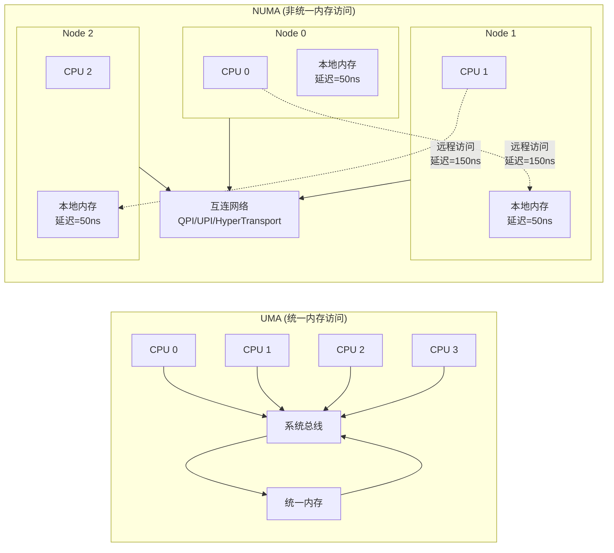

**图表 0-2: 虚拟地址到物理地址转换**
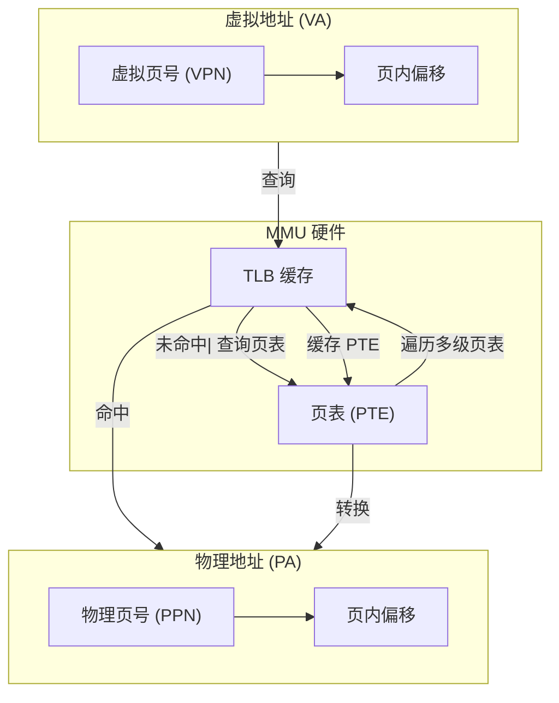

**图表 0-3: 32位 vs 64位地址空间**
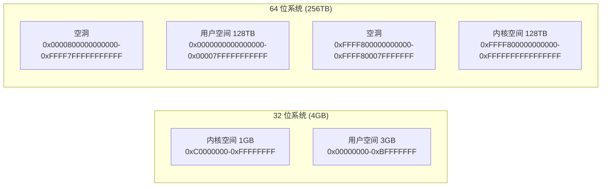

**图表 0-4: Linux 内存管理演进时间线**
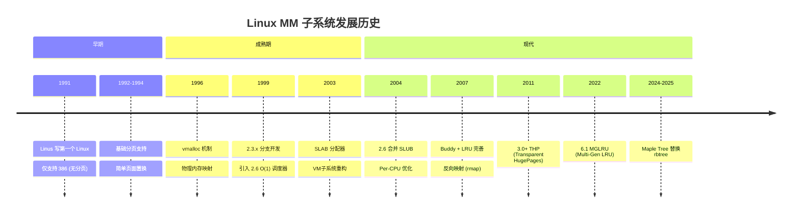

### 3.1 全局架构图（Chapter 1）

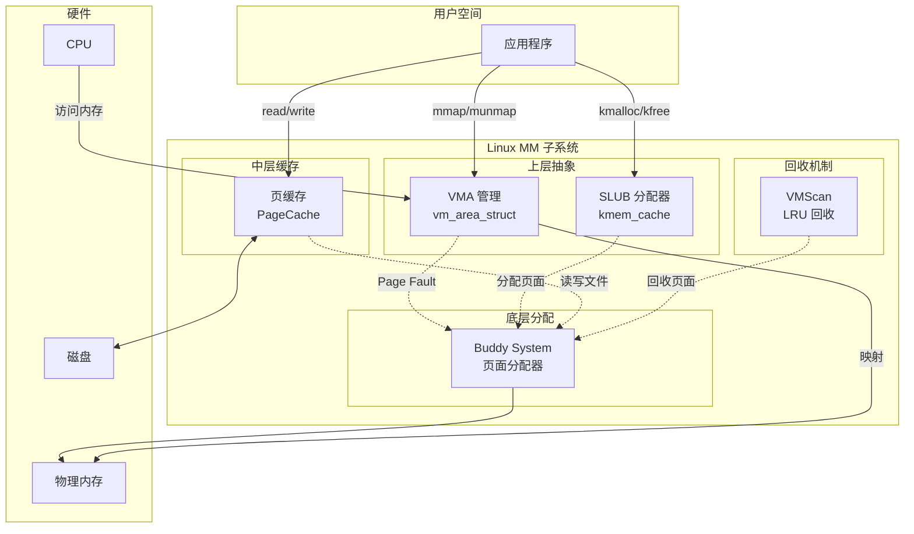

### 3.2 VMA 章节图表

**图表 2-1: mm_struct 和 VMA 关系图**
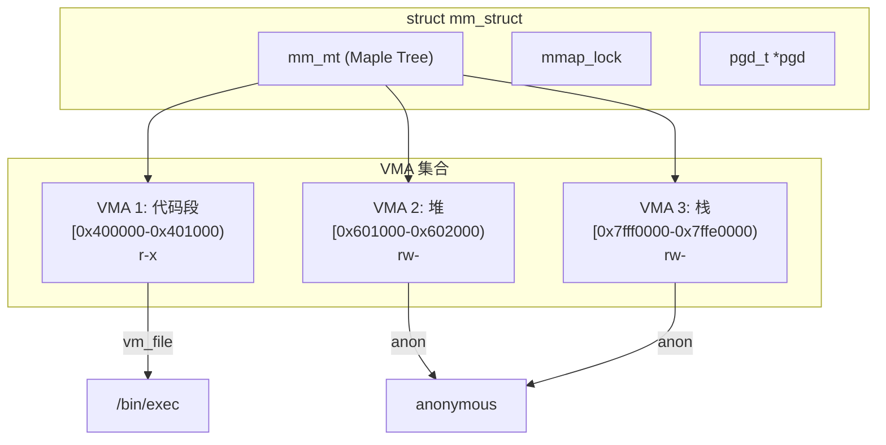

**图表 2-2: mmap 系统调用时序图**
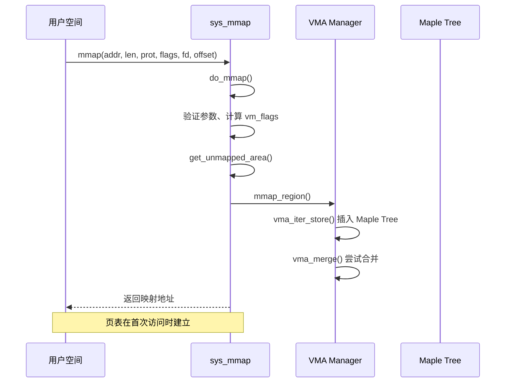

### 3.3 Buddy System 章节图表

**图表 3-1: 伙伴关系示意图**
```
物理地址 (PFN):
0      1      2      3      4      5      6      7
|--------|--------|--------|--------|--------|--------|--------|--------|
 Block 0  Block 1  Block 2  Block 3  Block 4  Block 5  Block 6  Block 7

Order 0 (1页) buddies:
  0↔1, 2↔3, 4↔5, 6↔7

Order 1 (2页) buddies:
  [0+1]↔[2+3], [4+5]↔[6+7]

Order 2 (4页) buddies:
  [0..3]↔[4..7]

公式: buddy_pfn = pfn XOR (1 << order)
```

**图表 3-2: 分配流程图**
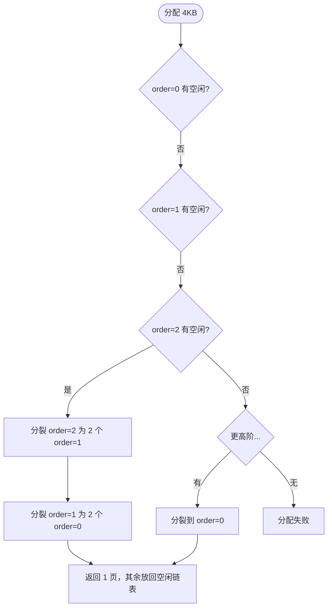

### 3.4 PageCache 章节图表

**图表 4-1: address_space 和 XArray 关系**
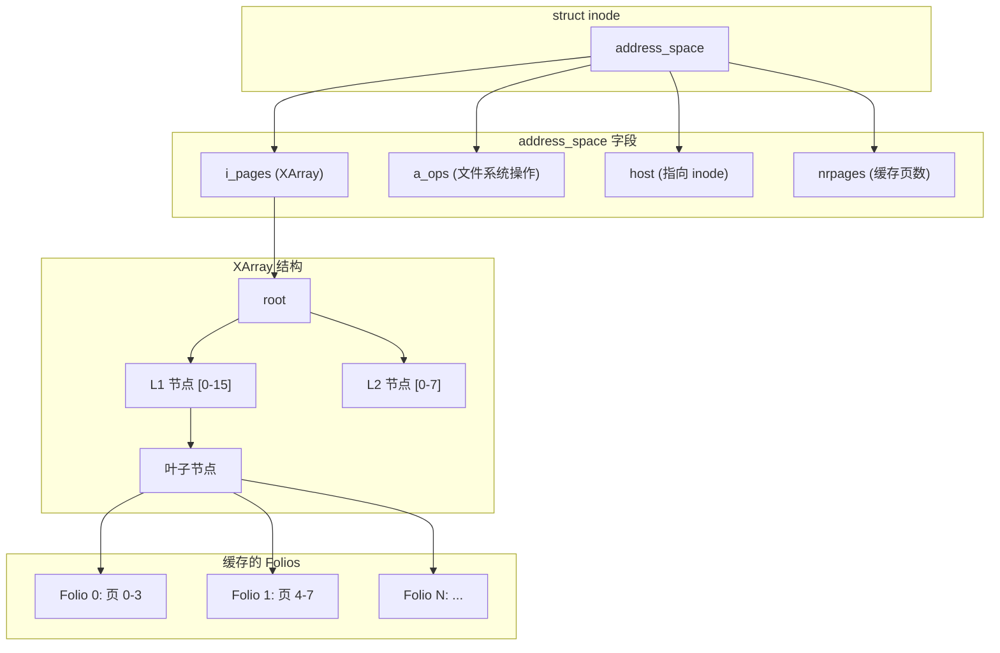

**图表 4-2: Page Fault 处理流程**
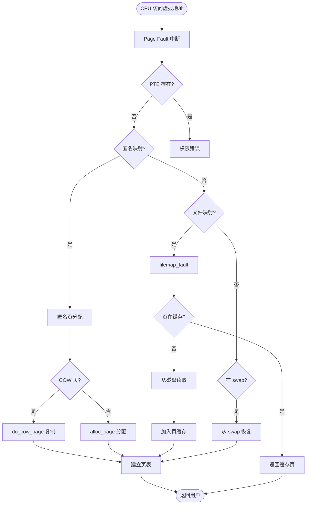

### 3.5 SLUB 章节图表

**图表 5-1: SLUB 架构图**
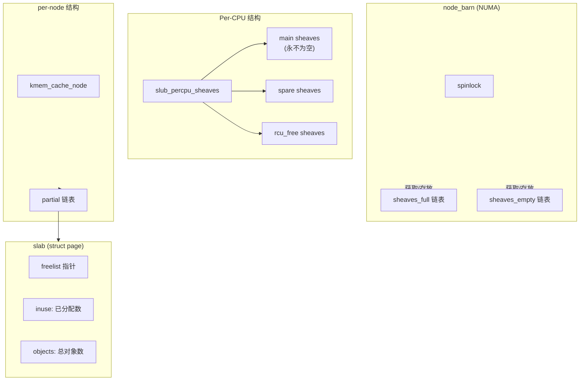

**图表 5-2: 分配快速路径**
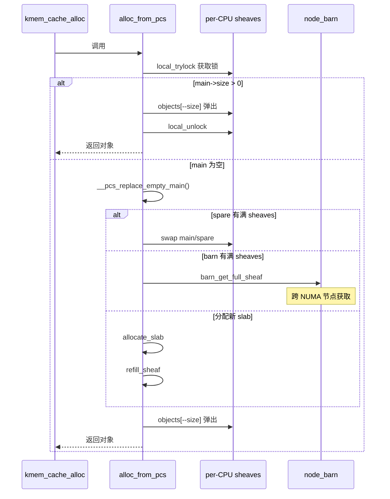

### 3.6 VMScan 章节图表

**图表 6-1: LRU 链表结构**
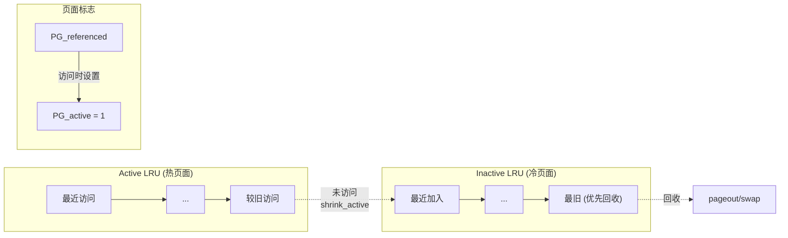

**图表 6-2: kswapd 工作流程**
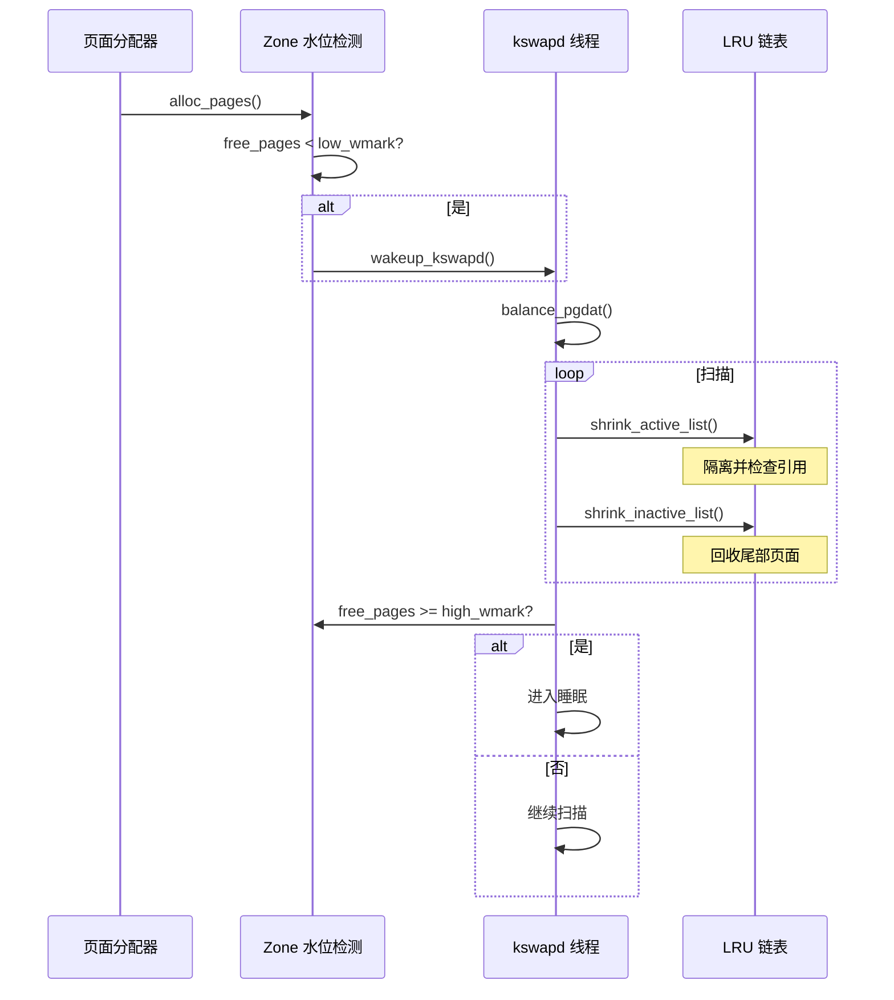

### 3.7 模块关系图（Chapter 7）

**图表 7-1: 完整调用链**
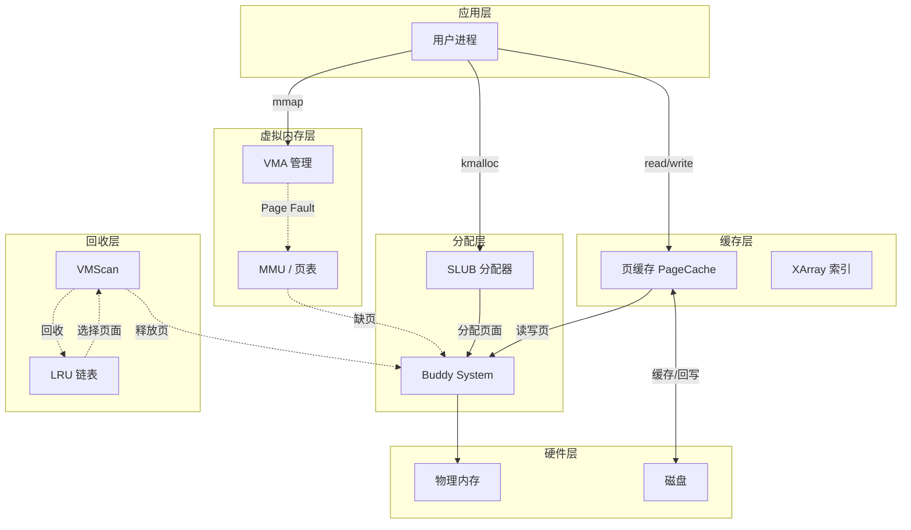

---

## 四、CSS 样式设计

### 4.1 深色主题配色方案

```css
:root {
    /* 背景色 */
    --bg-primary: #0d1117;      /* 主背景：深灰黑 */
    --bg-secondary: #161b22;    /* 次背景：稍浅灰 */
    --bg-tertiary: #21262d;     /* 第三背景：卡片背景 */
    --bg-code: #1c2128;         /* 代码背景 */

    /* 文字色 */
    --text-primary: #e6edf3;    /* 主要文字：浅灰白 */
    --text-secondary: #8b949e;  /* 次要文字：中灰 */
    --text-muted: #6e7681;      /* 淡化文字 */

    /* 强调色 */
    --accent-blue: #58a6ff;     /* 蓝色链接 */
    --accent-green: #3fb950;    /* 绿色成功/强调 */
    --accent-purple: #a371f7;   /* 紫色重点 */
    --accent-orange: #d29922;   /* 橙色警告 */
    --accent-red: #f85149;      /* 红色错误 */

    /* 边框 */
    --border-default: #30363d;
    --border-muted: #21262d;

    /* 渐变 */
    --gradient-hero: linear-gradient(135deg, #0d1117 0%, #161b22 50%, #1a1f29 100%);
    --gradient-card: linear-gradient(145deg, #21262d 0%, #161b22 100%);
    --gradient-accent: linear-gradient(135deg, #58a6ff 0%, #a371f7 100%);
}
```

### 4.2 组件样式

```css
/* 导航栏 */
#navbar {
    position: fixed;
    top: 0;
    left: 0;
    right: 0;
    background: rgba(13, 17, 23, 0.95);
    backdrop-filter: blur(10px);
    border-bottom: 1px solid var(--border-default);
    z-index: 1000;
}

/* 章节标题 */
.chapter-title {
    font-size: 2rem;
    color: var(--text-primary);
    border-bottom: 2px solid var(--accent-blue);
    padding-bottom: 0.5rem;
    margin-top: 3rem;
}

/* 教学要点框 */
.summary-box {
    background: var(--gradient-card);
    border: 1px solid var(--border-default);
    border-left: 4px solid var(--accent-blue);
    border-radius: 8px;
    padding: 1.5rem;
    margin: 1.5rem 0;
}

.summary-box h4 {
    color: var(--accent-blue);
    margin-top: 0;
}

/* 代码块 */
pre {
    background: var(--bg-code);
    border: 1px solid var(--border-default);
    border-radius: 6px;
    padding: 1rem;
    overflow-x: auto;
    font-size: 0.9rem;
}

code {
    background: var(--bg-code);
    color: var(--accent-green);
    padding: 0.2em 0.4em;
    border-radius: 4px;
    font-size: 0.9em;
}

/* Mermaid 图表容器 */
.mermaid {
    background: var(--bg-secondary);
    border: 1px solid var(--border-default);
    border-radius: 8px;
    padding: 1.5rem;
    margin: 1.5rem 0;
    text-align: center;
}

/* 表格 */
table {
    width: 100%;
    border-collapse: collapse;
    margin: 1rem 0;
}

th, td {
    border: 1px solid var(--border-default);
    padding: 0.75rem;
    text-align: left;
}

th {
    background: var(--bg-secondary);
    color: var(--text-primary);
}

tr:nth-child(even) {
    background: var(--bg-tertiary);
}

/* 锚点样式 */
:target {
    background: var(--accent-blue);
    opacity: 0.1;
}
```

### 4.3 响应式设计

```css
@media (max-width: 768px) {
    #navbar {
        flex-wrap: wrap;
        padding: 0.5rem;
    }

    .chapter-title {
        font-size: 1.5rem;
    }

    pre {
        font-size: 0.8rem;
    }
}
```

---

## 五、实现检查清单

### 5.1 结构检查

- [ ] 深色主题 CSS
- [ ] 固定顶部导航栏
- [ ] 锚点链接
- [ ] 响应式设计
- [ ] Mermaid 图表

### 5.2 内容检查

- [ ] Chapter 1: 全景图和模块依赖
- [ ] Chapter 2: VMA What-How-Why
- [ ] Chapter 3: Buddy System What-How-Why
- [ ] Chapter 4: PageCache What-How-Why
- [ ] Chapter 5: SLUB What-How-Why
- [ ] Chapter 6: VMScan What-How-Why
- [ ] Chapter 7: 模块关系总结
- [ ] Chapter 8: 学习路线图

### 5.3 图表检查

- [ ] 全局架构图
- [ ] VMA 数据结构图
- [ ] mmap 时序图
- [ ] Buddy 伙伴关系图
- [ ] Buddy 分配流程图
- [ ] PageCache XArray 结构图
- [ ] Page Fault 流程图
- [ ] SLUB 架构图
- [ ] SLUB 分配时序图
- [ ] LRU 链表结构图
- [ ] kswapd 工作流程图
- [ ] 模块依赖关系总图

### 5.4 教学要点检查

- [ ] 每个章节都有 What-How-Why 结构
- [ ] 每个章节都有教学要点总结框
- [ ] 每个章节都有实战/调试内容
- [ ] 关键代码路径标注源码位置
- [ ] 模块间依赖关系清晰

---

## 六、生成命令

```bash
# HTML 文件将写入
/home/cwtrocks/linux/docs/linux-mm-beginner-guide.html

# 参考文档位置
/home/cwtrocks/linux/docs/VMA-BEGINNER-GUIDE.md
/home/cwtrocks/linux/docs/buddy-system-tutorial.md
/home/cwtrocks/linux/docs/linux-pagecache-guide.md
/home/cwtrocks/linux/docs/slub-allocator-analysis.md
/home/cwtrocks/linux/drivers/android/docs/vmscan-memory-reclaim-guide.html
```
