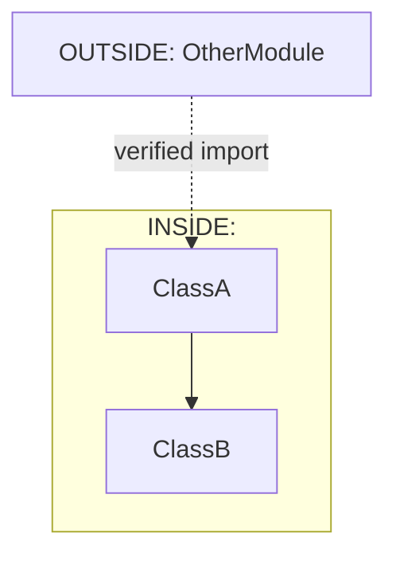
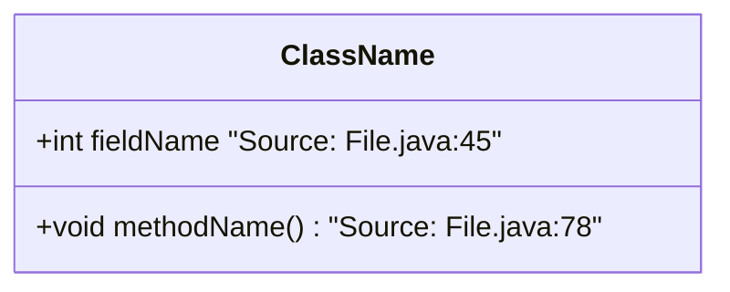
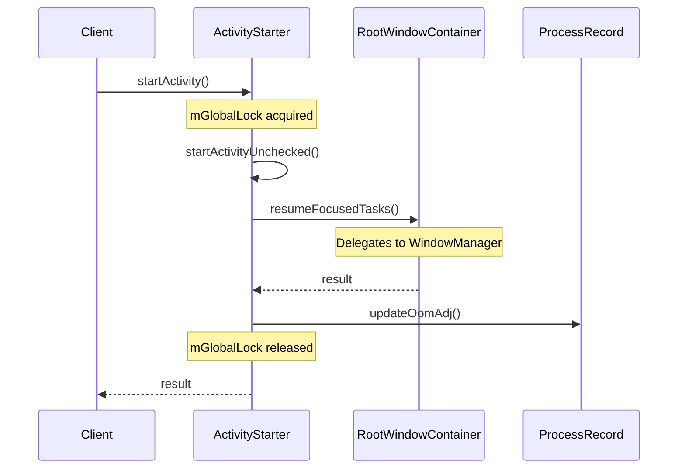

# Code Deep Exploration Skill v2.14

> **Anti-Hallucination Protocol**: This skill REQUIRES live source code verification at every step. Do NOT describe implementation details you have not read directly from source files. Every claim must cite the exact file:line.
>
> **v2.14 Execution Integrity + v2.13 Isolated Run**:
> - **MANDATORY: 5-10 critical paths per key module** (previously 1-2)
> - Added scoring & ranking system for path selection
> - Added 5-category coverage requirement (Core Business, Lifecycle, State, Cross-Module, Data Flow)
> - Added detailed suggested paths for common Android services
>
> **v2.11 Mandatory Module Coverage Rule**:
> - Phase 1 梳理出的**每一个模块**，都必须执行 Phase 2 的**全部 7 个 Round (R0-R6)**
> - 不得跳过任何模块，不得只做部分 Round
>
> **v2.10 Clean Slate Rule**:
> - Added mandatory clean slate rule: always delete old exploration directory before starting
> - Ensures fresh exploration without stale/partial results
>
> **v2.9 Critical Enforcement Upgrade**:
> - Added mandatory execution checkpoints before each Round
> - Added linear dependency enforcement (R0→R1→R2→R3→R4→R5→R6)
> - Added STOP criteria when previous Round is incomplete
> - Added pre-flight checks before Phase 2 begins

## Critical Rules (Non-Negotiable)

### 🚫 ABSOLUTE PROHIBITIONS

1. **Never fabricate method signatures** — If you have not read the exact source, write `[UNVERIFIED - requires source verification]`
2. **Never assume field names** — Field names MUST be verified by reading the source file directly
3. **Never guess inheritance hierarchies** — Always verify with actual `extends`/`implements` keywords in source
4. **Never infer lock types** — Lock acquisition must be verified by reading synchronized blocks or explicit lock calls

### 🗑️ ISOLATED RUN RULE (MANDATORY)

Each exploration run writes to its own **isolated, timestamped directory**:

```
docs/exploration-YYYYMMDD-HHMMSS-XXXXX/
```

**How it works:**
- On each invocation, run `./scripts/workspace <target> <name>` — it generates a unique run ID
- The run ID = `YYYYMMDD-HHMMSS-RRRRR` (5-digit random suffix, 10000–99999)
- All output goes into `docs/exploration-<RUN_ID>/`
- Previous runs are **never deleted** — each has its own directory

**Why this is better than Clean Slate:**
- No risk of accidentally overwriting a useful prior run
- Parallel explorations of the same target don't interfere
- History is preserved for comparison

**Example:**
```
# Run 1 (2026-08-09 14:30, random 48291)
docs/exploration-20260809-143012-48291/
  01-file-inventory.html
  02-module-division.html
  myproject-module-map.html

# Run 2 (2026-08-09 15:00, random 71953) — different directory, no conflict
docs/exploration-20260809-150043-71953/
  01-file-inventory.html
  ...
```

### ✅ MANDATORY PRACTICES

1. **Cite sources inline**: Every technical claim must include `[Source: FileName.java:123]`
2. **Read before describing**: Open the actual source file before describing its behavior
3. **Verify at boundaries**: Cross-module calls MUST be verified by reading both caller and callee
### R4 COMPLETENESS ENFORCEMENT (v2.2 Upgrade)

A module is PARTIAL if any round (R0-R6) is missing. PARTIAL modules do NOT count toward Completeness numerator.

**R4 minimum content**:
- Entry Point with grep-verified line number
- Mermaid sequenceDiagram with all cross-class calls
- Call chain table: Step | Method | Source (grep实测) | Thread | Lock | Type
- Lock/thread/Binder annotations all present

**PARTIAL marking rule**: Append [PARTIAL] to module name, list missing rounds in audit.

### LINE NUMBER VERIFICATION (v2.3 Upgrade)

Every call chain annotation MUST use line numbers verified from current source branch.
Run: grep -n "methodName" <file>.java | grep -v "//"
Never use line numbers from training data or old documentation.

### ARCHITECTURE ROUTING VERIFICATION (v2.4 Upgrade)

For each cross-class call (B -> C), verify C actually has the called method.
Run: grep -n "void method|public.*method|private.*method" C.java
If grep returns empty: method does not exist in C -- call chain is WRONG

### WMS PRE-SCAN RULE (v2.5 Upgrade)

Before starting WMS (257 files, 8+ modules), pre-scan module count.
Module classification: Core = Must reach FULL; ATMS-scope = Partial OK; Future = Skip

### COMPLETENESS STRICT MODE (v2.6 Upgrade)

When Completeness < 4/5, output must include:
1. Per-module completion table (FULL / PARTIAL / Uncharted)
2. For each PARTIAL: which rounds missing (R0-R6)
3. For each FULL: grep-verified method line numbers
4. Missing rounds manifest before audit conclusion

Minimum per-iteration: at least 2 FULL modules, at most 2 PARTIAL modules.

---

## CRITICAL EXECUTION ORDER (MUST FOLLOW)

### Phase 1 Linear Dependencies
```
Round 1 (File Inventory) → Round 2 (Module Division) → Round 3 (Module Map)
```
❌ Round 2 cannot start until Round 1 output exists
❌ Round 3 cannot start until Round 1 AND Round 2 outputs exist

### Phase 2 File Model (PER MODULE)

**Every module has exactly 2 output files:**

| File | When Created | What it Contains |
|------|-------------|-----------------|
| `<name>-<module>-anchor.html` | **R0 (always CREATE)** | R0 Anchor + R1 Architecture + R2 Class Diagram + R3 Data Structures |
| `<name>-<module>-deep-dive.html` | **R4 (always CREATE)** | R4 Call Chains + R5 Sequences + R6 Summary |

**How each Round writes:**

```
Round 0 (Anchor):        CREATE  <name>-<module>-anchor.html        ← fresh file
Round 1 (Architecture): APPEND  <name>-<module>-anchor.html        ← append to anchor
Round 2 (Class Diagram):APPEND  <name>-<module>-anchor.html        ← append to anchor
Round 3 (Data Structs): APPEND  <name>-<module>-anchor.html        ← append to anchor
Round 4 (Call Chains):  CREATE  <name>-<module>-deep-dive.html     ← fresh file
Round 5 (Sequences):    APPEND  <name>-<module>-deep-dive.html     ← append to deep-dive
Round 6 (Summary):      APPEND  <name>-<module>-deep-dive.html     ← append to deep-dive
```

**⚠️ STOP — you MUST update the Linear State Tracker (see below) after EVERY Round.**

### Linear State Tracker (MANDATORY — update after EVERY Round)

**Copy-paste this tracker into your response after finishing each Round. If you do not update it, the skill treats that Round as INCOMPLETE.**

```
╔══════════════════════════════════════════════════════════════════╗
║  LINEAR STATE TRACKER — <name>/<module>                       ║
╠══════════════════════════════════════════════════════════════════╣
║  Phase 1                                                       ║
║    R1 (File Inventory)   : [✅ DONE | ⬜ PENDING]            ║
║    R2 (Module Division)  : [⬜ PENDING | ⬜ BLOCKED]           ║
║    R3 (Module Map)       : [⬜ PENDING | ⬜ BLOCKED]           ║
╠══════════════════════════════════════════════════════════════════╣
║  Phase 2 — Module: <module-name>                               ║
║    R0 (Anchor)           : [⬜ PENDING | 🔄 IN_PROGRESS]        ║
║    R1 (Architecture)    : [⬜ BLOCKED]                        ║
║    R2 (Class Diagram)   : [⬜ BLOCKED]                        ║
║    R3 (Data Structures) : [⬜ BLOCKED]                        ║
║    R4 (Call Chains)     : [⬜ BLOCKED]                        ║
║    R5 (Sequences)       : [⬜ BLOCKED]                        ║
║    R6 (Summary)        : [⬜ BLOCKED]                        ║
╠══════════════════════════════════════════════════════════════════╣
║  BLOCKED = cannot start until previous Round is DONE            ║
║  IN_PROGRESS = currently working on this Round                 ║
║  DONE = output file written, tracker updated                  ║
╚══════════════════════════════════════════════════════════════════╝
```

### Execution Checkpoints (per Round)

**Before starting Round N, you MUST verify ALL of:**

1. **State Check:** The Linear State Tracker shows Round N-1 as `DONE`
2. **File Check:** The expected output file for Round N-1 exists
3. **Content Check:** You can cite at least 2 specific findings from Round N-1's output
4. **Tracker Update:** You have updated the Linear State Tracker to show N-1 = `DONE`

**WRONG (will not be tolerated):**
```
Skipping R0-R3, starting R4 directly...
```

**CORRECT — after completing Round 0 (Anchor):**
```
Round 0 Anchor: COMPLETE ✓
  - anchor.html CREATED
  - Module boundaries established
  - Entry points verified
  - Source citations: ServiceRecord.java:81, ActiveServices.java:268
  - Classes: ProcessRecord, ProcessList, OomAdjuster confirmed

Updating Linear State Tracker:
  R0: DONE → R1: UNBLOCKED ✓

Starting Round 1: Architecture...
```

### STOP Criteria
If ANY of these occur, STOP immediately and report:
- Round N-1 is not `DONE` in tracker → Cannot start Round N
- Output file for Round N-1 does not exist → Create it first
- Attempting to skip a Round → FORBIDDEN
- Fewer than 5 critical paths for a module → INCOMPLETE

---

## Two-Phase Workflow

```
Phase 1: Module Map (Round 1–3)
    → R1 File inventory → R2 Module division → R3 Unified module map
    → Output: <target>/docs/exploration-<RUN_ID>/<name>-module-map.html

Phase 2: Per-Module Deep Dive (Round 0–6 per module)
    → R0 CREATE anchor → R1/R2/R3 APPEND to anchor → R4 CREATE deep-dive → R5/R6 APPEND to deep-dive
    → 2 output files per module: <name>-<module>-anchor.html + <name>-<module>-deep-dive.html
```

**⚠️ MANDATORY: ALL MODULES MUST COMPLETE ALL PHASE 2 ROUNDS**

Phase 1 梳理出的**每一个模块**，都必须执行 Phase 2 的**全部 7 个 Round (R0-R6)**。

- ❌ 不允许跳过任何模块
- ❌ 不允许只做部分 Round
- ❌ 不允许"可选"或"跳过"的措辞
- ✅ 每个模块都必须达到 "深度探索完成" 状态
- ✅ 每个 Round 完成后必须更新 Linear State Tracker

---

---

## Phase 1: Module Map

### Round 1 — File Inventory

**Objective**: Enumerate all source files with verified responsibilities.

**Inputs**:
- `{{TARGET_DIR}}` — target directory to explore
- `prompts/round1-file-inventory.md`

**Process**:
1. List ALL `.java` files recursively in the target directory
2. For each file, READ the source (not just scan names)
3. Determine responsibility from actual class declarations and key methods
4. Classify: **Core** (primary logic) vs **Supporting** (utilities, helpers)

**Anti-Hallucination Checkpoint**:
```
□ Every file listed exists in the directory
□ Responsibility derived from reading file content, not filename
□ Key class names match actual `class`/`interface` declarations
□ Entry points verified by reading method signatures
```

**Output**: `<target>/docs/exploration-<RUN_ID>/01-file-inventory.html`

---

### Round 2 — Module Division

**Objective**: Divide files into functional modules with verified boundaries.

**Inputs**:
- `{{TARGET_DIR}}/docs/exploration-<RUN_ID>/01-file-inventory.html`
- `prompts/round2-module-division.md`

**Process**:
1. Group files by functional responsibility
2. For each module, identify:
   - Core classes (must read actual source)
   - Entry points (Binder AIDL, public API, Handler messages)
   - Data structures (must exist in source)
   - Dependencies (must verify with actual imports)

**AMS/ATMS/WM Split Handling** (Android-specific):
```
IF exploring frameworks/base/services/core/java/com/android/server/am/:
  → AMS: ActivityManagerService.java, ProcessList.java, OomAdjuster.java
  → ATMS: ActivityTaskManagerService.java, ActivityTaskSupervisor.java
  → WM: (separate: frameworks/base/services/core/java/com/android/server/wm/)
  → BOUNDARY: Explicitly mark files that bridge AMS↔ATMS↔WM
  
IF exploring frameworks/base/services/core/java/com/android/server/wm/:
  → WM: WindowManagerService.java, RootWindowContainer.java
  → ATMS: ActivityTaskManagerService.java (cross-reference, do not fully explore)
  → BOUNDARY: Mark files that bridge WM↔ATMS
```

**Anti-Hallucination Checkpoint**:
```
□ Module boundaries verified by reading source file contents
□ No file assigned to module without reading its package/class declarations
□ Dependencies verified by checking actual `import` statements in source
□ Cross-module boundaries marked with explicit "DO NOT EXPLORE" notes
```

**Output**: `<target>/docs/exploration-<RUN_ID>/02-module-division.html`

---

### Round 3 — Module Map Document

**Objective**: Consolidate into a single source of truth with architecture diagram.

**Inputs**:
- `01-file-inventory.html`
- `02-module-division.html`
- `prompts/round3-module-map-doc.md`

**Process**:
1. Create Mermaid flowchart showing module relationships
2. Document each module's responsibility (verified from source)
3. List cross-module dependencies (verified from imports)
4. Provide exploration order with rationale

**Quality Gate**:
```
□ Architecture diagram matches verified file structure
□ No module description contains unverified claims
□ Exploration order justified (foundation modules first)
□ All file counts accurate
```

**Output**: `<target>/docs/exploration-<RUN_ID>/<name>-module-map.html`

---

## PHASE 2 ENTRY CHECKLIST (MANDATORY — do not skip)

**Before starting Phase 2 for ANY module, you MUST complete ALL of the following.**

### Pre-conditions
```
□ Phase 1 R3 (Module Map) is DONE (output file exists)
□ Phase 1 module list has been read and understood
□ All Phase 2 modules are listed with their categories
□ Exploration order is determined (foundation modules first)
□ Each module will execute R0→R1→R2→R3→R4→R5→R6 in order
□ Output directory <target>/docs/exploration-<RUN_ID>/ exists
□ RUN_ID is confirmed (from workspace script output)
```

### Per-module pre-conditions (repeat for each module)
```
□ Module: <name>
□ Module category: [A|B|C|D|E]
□ Files in this module: listed from R1 inventory
□ Core class: <class name> — <source file>:<line>
□ Entry points: listed from R1 inventory
□ Phase 2 paths: 5-10 paths selected covering all 5 categories
□ State Tracker initialized for this module (all R0-R6 = PENDING)
```

**If any pre-condition is NOT met → STOP and fix before proceeding.**

---

## Phase 2: Per-Module Deep Dive

**⚠️ 执行规则：Phase 1 梳理出的每一个模块，都必须执行全部 7 个 Round**

- Phase 1 会输出模块列表（如 Module A, Module B, Module C...）
- Phase 2 必须对 Module A、Module B、Module C... **逐一**执行 R0-R6
- 不得跳过任何模块，不得中断模块的 Round 序列
- 建议按模块间的依赖关系排序（被依赖的模块先做）

**⚠️ PHASE 2 EXECUTION CHECKPOINT (BEFORE STARTING)**

**YOU MUST COMPLETE ALL 7 ROUNDS IN ORDER FOR EACH MODULE:**

| Round | Must Complete Before | Output File |
|-------|---------------------|------------|
| R0 Anchor | Phase 1 Complete | `<name>-<module>-anchor.html` |
| R1 Architecture | R0 Complete | append to anchor.html |
| R2 Class Diagram | R1 Complete | append to anchor.html |
| R3 Data Structures | R2 Complete | append to anchor.html |
| R4 Call Chains | R3 Complete | `<name>-<module>-deep-dive.html` |
| R5 Sequences | R4 Complete | append to deep-dive.html |
| R6 Summary | R5 Complete | `<name>-<module>-deep-dive.html` |

**MANDATORY PRE-ROUND CHECK:**
```
□ Previous Round output file exists?
□ Previous Round cited sources verified?
□ Previous Round conclusions used as input?
□ Can I cite specific findings from previous Round?
```

**IF ANY CHECK FAILS → Complete previous Round FIRST before proceeding**

### Phase 2: Critical Path Deep Trace (Beginner-Oriented, Function-Level)

### Purpose
Enable a newcomer to walk one real system-service flow end-to-end in source code, at function-call granularity—not only module names or high-level architecture.

Phase 0 builds the map. Phase 1 builds module understanding. Phase 2 builds path mastery.

Phase 2 is mandatory for every priority module selected in Phase 1, unless explicitly scoped otherwise by the user.

---

### 2.1 Scope and Depth Modes

Default depth for Phase 2: **L3 Path (Comprehensive)**.

| Mode | When to use | Requirement |
|------|-------------|-------------|
| L1 Survey | Orientation only | No Phase 2 |
| L2 Module | Module overview already done in Phase 1 | Entry-level chains only; private helpers optional |
| L3 Path (default) | Beginner mastery of a real flow | **5-10 critical paths per key module**, full function-level expansion |
| L4 Comprehensive | Deep expertise required | All public methods, full coverage |

**L3 Path (Comprehensive) — MANDATORY minimum:**

- **5-10 critical paths per key module** (see Section 2.2)
- Each path must cover different aspects of the module
- All 5 categories (Core Business, Lifecycle, State Management, Cross-Module, Data Flow) must be represented
- Prefer **diverse paths covering different responsibilities** over multiple similar paths

Rules:
- **Do NOT** limit to only 1-2 paths — this misses critical module functionality
- **Do NOT** try to cover every method — stay within 5-10 high-value paths
- **Do** ensure category coverage even if it means fewer total paths

---

### 2.2 Critical Path Selection

**⚠️ MANDATORY: Select 5-10 critical path functions per key module**

Each key module must have **at least 5, at most 10** critical path functions analyzed. This ensures comprehensive coverage of the module's core responsibilities.

---

#### 2.2.1 Candidate Discovery Process

**Step 1: Enumerate all public/Binder entry points**
```bash
# Find public methods in service class
grep -n "public.*void\|public.*boolean\|public.*int\|public.*String\|public.*IBinder" \
  <service-class>.java | grep -v "//" | head -50

# Find Binder transaction codes
grep -n "TRANSACTION_" <aidl-interface>.java
```

**Step 2: Identify lifecycle/state management methods**
- Service lifecycle: `onCreate`, `onDestroy`, `onStartCommand`, `onBind`
- State transitions: `setState`, `transitionTo`, `moveTo`
- Initialization: constructors, `init`, `initialize`, `onBootPhase`

**Step 3: Map user-facing operations**
- From AIDL/Stubs: every `onTransact` case
- From public API: every `public` method
- From messages: every `H.` constants that trigger work

**Step 4: Cross-module interaction points**
- Calls to other system services (AMS, PMS, WMS, etc.)
- AIDL interface implementations
- Broadcast发送/接收点
- ContentProvider 调用点

---

#### 2.2.2 Scoring & Ranking System

For each candidate, score 1-5 on each dimension (higher = better):

| Dimension | 1 | 2 | 3 | 4 | 5 |
|-----------|----|----|----|----|----|
| **Impact** | Rare edge case | Low frequency | Normal | High frequency | Core feature |
| **Complexity** | 1-2 hops | 3-5 hops | 6-10 hops | 11-20 hops | 20+ hops |
| **Learning Value** | Boilerplate | Utility | Support function | Key flow | Essential to know |
| **Code Stability** | Frequently changes | Sometimes changes | Stable | Core API | Immutable |
| **Cross-Module** | Internal only | 1 external | 2 external | 3 external | 4+ external |

**Weighted Score = Impact×2 + Complexity + LearningValue + CodeStability + CrossModule×1.5**

---

#### 2.2.3 Mandatory Coverage Requirements

Each module must include paths from **ALL five categories**:

| Category | Description | Min Required |
|----------|-------------|--------------|
| **A. Core Business** | Primary responsibility functions | 2 |
| **B. Lifecycle** | init/start/stop/destroy sequences | 1 |
| **C. State Management** | State transitions, observers | 1 |
| **D. Cross-Module** | Calls to external services | 1 |
| **E. Data Flow** | Data read/write, persistence | 1 |

**If a module lacks a category, document why and substitute with another high-value path.**

---

#### 2.2.4 Final Selection Criteria

Select top candidates ensuring:

1. **Minimum 5, Maximum 10 paths** per key module
2. **Category coverage** — all 5 categories represented
3. **No redundancy** — paths should not be duplicates of each other
4. **Source verified** — entry point must exist in current source

**For each selected path, state upfront:**

```markdown
#### Path N: <beginner-friendly name>

- **Entry:** ClassName.methodName(...)
- **Category:** [A|B|C|D|E] Core Business | Lifecycle | State Management | Cross-Module | Data Flow
- **Score:** <weighted score>
- **End condition:** <concrete success condition in code>
- **Why it matters:** <1-2 sentences>
- **Out of scope:** <deferred edges>
```

---

#### 2.2.5 Anti-Patterns (REJECT these paths)

- ❌ Paths that only bounce between facades with no core logic
- ❌ Paths with no stable entry or no observable end condition
- ❌ Duplicate paths that cover the same ground
- ❌ Only utility/helper methods without public entry
- ❌ Deprecated methods (check `@Deprecated` annotation)

---

#### 2.2.6 Path Prioritization Order

When time is limited, prioritize in this order:

1. **Category A (Core Business)** — highest impact paths
2. **Category C (State Management)** — understanding module internals
3. **Category D (Cross-Module)** — understanding system integration
4. **Category B (Lifecycle)** — service initialization
5. **Category E (Data Flow)** — data persistence

**If forced to cut, keep at least 3 paths covering Categories A+C+D.**

---

### 2.3 Function-Level Expansion Rules

Start from the entry method and expand hop-by-hop until the success end condition is reached.

For **every significant hop**, record:
1. **Exact** ClassName.methodName()
2. **Thread** (Binder / main / service Handler thread / unknown—say unknown if not clear)
3. **Key parameters** and what they represent in this flow
4. **Important branches** (success path vs reject / early-return conditions)
5. **Locks**: lock name, acquire/release points, relative order when nested
6. **Async boundaries**: Binder calls, Handler.post / sendMessage, other queues
7. **Data effects**: which core structure fields are read or written at this hop

Expansion discipline:
- **Do NOT** stop at high-level facades (*Controller, *Supervisor, thin wrappers) when real work is in starter/impl/helper methods.
- **Do** expand important private/helper methods when they contain business logic.
- If a method is very large, split it into numbered logical sections (Section A/B/C) and explain each section's role in the path.
- Cross-module calls may be named, but do not fully deep-dive foreign modules unless required to understand this path's end condition; mark them as **cross-module boundary**.
- If source evidence is missing, write "not found in provided/read source"—never invent calls from memory of older Android versions.

Minimum bar for a complex happy path:
- Enough intermediate hops to show real control flow (not a 2-3 hop skeleton)
- At least one non-trivial private/helper expanded when such logic exists
- Locks/async annotated when present in source
- Field-level data changes at multiple meaningful steps

---

### 2.4 Required Output Structure (per critical path)

Every critical path output **must** use this structure:

#### Path: <beginner-friendly name>

- **Entry:** ClassName.methodName(...)
- **End condition:** <concrete success condition in code>
- **Why it matters:** <1-2 sentences>
- **Out of scope:** <deferred edges>

##### 1) Function-level call chain
Numbered hops:
1. Class.method
   - thread:
   - key args:
   - branches:
   - locks / async:
   - data read/write:
   - next →
2. ...
N. <hop where end condition is satisfied>

##### 2) Sequence diagram
Mermaid sequenceDiagram for the **happy path** only (participants = real classes/objects).

##### 3) Major decision branches (short)
Bullet list of important reject/early-return paths; full expansion optional.

##### 4) Data changes along the path
Table:

| Step | Structure.field | Change / meaning |
|------|-----------------|------------------|

##### 5) Locks, threads, and async summary
- Lock order notes and deadlock cautions if relevant
- Thread switches and posted work

##### 6) Beginner follow-along guide (plain language)
Step-by-step:
1. Open file → method — what you are looking at
2. ...
N. Confirm end condition: what to see in state/logs/fields

Include **common confusion points** (naming traps, AMS vs ATMS, sync vs posted work, etc.).

##### 7) Minimal ordered reading list
10 methods or fewer when possible, in the order a beginner should open them:

1. Class.method — file path if known
2. ...

##### 8) Learning checkpoints
Table:

| Step | Class.method | What happens | Data changed | Next |

---

### 2.5 Beginner Pedagogy Rules

- Prefer **clarity and walkability** over encyclopedic coverage.
- Put **Follow-along (6)** and **Reading list (7)** in every path output; these are not optional appendices.
- Use concrete names from source (ActivityRecord, mState, etc.), not vague phrases.
- When modern code is split across services (e.g. AMS / ATMS / WM), say **which process/class owns the hop**.
- End each path with a one-line **"You now understand…"** takeaway.

---

### 2.6 MANDATORY EXECUTION CHECKLIST (BEFORE EACH ROUND)

**Print and verify BEFORE starting each Round:**

#### For Round 0 (Anchor):
```
□ Module selected from Phase 1 module map
□ Core files identified (main service class read)
□ Class declaration verified (class Xxx { )
□ Package verified
□ Entry points identified from method signatures (public/protected)
□ Cross-module references marked [REF - do not explore]
□ Output file: <name>-<module>-anchor.html
```

#### For Round 1 (Architecture):
```
□ Round 0 anchor.html exists
□ Read and cited from Round 0 findings
□ Internal components identified from source
□ External dependencies verified by import statements
□ Lock types verified (synchronized blocks read)
□ Handler threads verified
□ Output: append to anchor.html
```

#### For Round 2 (Class Diagram):
```
□ Round 1 architecture output exists
□ Inheritance verified (extends/implements from source)
□ Field types verified from declarations
□ Method signatures verified
□ Relationships verified by field assignments
□ Output: append to anchor.html
```

#### For Round 3 (Data Structures):
```
□ Round 2 class diagram exists
□ All field declarations read
□ State fields identified
□ State machine transitions verified
□ Collection types verified
□ Output: append to anchor.html
```

#### For Round 4 (Call Chains):
```
□ Round 3 data structures exist
□ Entry point method read (entire method body)
□ Each call verified in source
□ Line numbers verified via grep
□ Lock/Binder/Handler annotated
□ Output: <name>-<module>-deep-dive.html
```

#### For Round 5 (Sequences):
```
□ Round 4 call chains exist
□ Sequence matches call chain table
□ Async boundaries marked
□ Data changes documented
□ Output: append to deep-dive.html
```

#### For Round 6 (Summary):
```
□ All R0-R5 outputs exist
□ No unverified claims remaining
□ All diagrams consistent
□ Source citations complete
□ Output: <name>-<module>-deep-dive.html
```

**⚠️ WITHOUT completing this checklist, you CANNOT proceed to next Round**

---

### 2.7 Quality Bar (Phase 2 PASS criteria)

Phase 2 for the primary path PASSes only if all hold:

1. **Entry and end condition** are explicit and source-grounded
2. **Call chain** is function-level and reaches core work (not facade-only)
3. **Important private/helper logic** on the path is expanded when present
4. **Locks / threads / Binder / Handler** annotated where applicable
5. **Data-change table** has meaningful field-level rows (>=3 when the path mutates state)
6. **Mermaid sequence diagram** matches the written happy path
7. **Beginner follow-along + ordered reading list** are present and usable alone
8. **No hallucinated methods** or outdated architecture presented as current fact

Failure modes that must FAIL audit:
- 2-3 hop skeleton for a complex flow
- No field-level data changes on a state-mutating path
- Missing follow-along or reading list
- Stopping before the stated end condition
- Mixing old AMS-only mental model with current ATMS/WM layout without labeling version/split

---

### 2.7 Relationship to Phase 0 / Phase 1

- Phase 0 identifies candidate entries and modules.
- Phase 1 explains classes and structures the path will touch.
- Phase 2 **reuses** those names and **must not contradict** Phase 1; if contradiction appears, re-check source and fix.
- Phase 2 may discover missing Module Map items; note them as **backfill for Module Map** without abandoning the path mid-trace.

---

### 2.8 Execution Budget (per key module)

**Target: 5-10 critical paths per key module**

| Path Category | Priority | Min Count |
|--------------|----------|-----------|
| A. Core Business | Highest | 2 |
| B. Lifecycle | Medium | 1 |
| C. State Management | High | 1 |
| D. Cross-Module | High | 1 |
| E. Data Flow | Medium | 1 |

If context is limited: prioritize A+C+D paths, defer B+E if necessary.

---

### 2.9 Suggested Critical Paths by Module (5-10 per module)

Use as starting hints; confirm against actual tree/version:

#### AMS / ATMS (ActivityManagerService / ActivityTaskManagerService)
| Category | Path | Entry Point |
|----------|------|-------------|
| A | startActivity happy path | `ActivityStarter.startActivity()` |
| A | startActivity result path | `ActivityStarter.startActivityUnchecked()` |
| A | Activity resume sequence | `ActivityStackSupervisor.resumeFocusedStack()` |
| B | Process start & attach | `AMS.attachApplication()` |
| B | Process kill path | `AMS.killProcess()` |
| C | OOM score update | `OomAdjuster.computeOomAdj()` |
| D | ATMS↔WMS coordination | `RootWindowContainer.resumeFocusedTasks()` |
| D | PMS permission check | `PMS.checkPermission()` |
| E | ProcessRecord update | `ProcessList.updateLruProcess()` |

#### WMS (WindowManagerService)
| Category | Path | Entry Point |
|----------|------|-------------|
| A | Add window | `WMS.addWindow()` |
| A | Window focus change | `WMS.setFocusedApp()` |
| A | Layout pass | `WMS.performLayoutLocked()` |
| A | Surface allocation | `SurfaceControl.transaction()` |
| B | WMS boot init | `WMS.onInitReady()` |
| C | Window state transition | `WindowStateTransitioning.setWindowWallpaper()` |
| D | ATMS activity window | `RootWindowContainer.getTopVisibleDisplayAreaInfo()` |
| E | WindowToken persistence | `WindowToken.saveToParcel()` |

#### PMS (PackageManagerService)
| Category | Path | Entry Point |
|----------|------|-------------|
| A | Package install | `PackageInstallerService.createSession()` |
| A | Package scan | `PackageParser2.parseBaseApk()` |
| A | Intent resolve | `PMS.resolveIntent()` |
| A | Permission grant | `PermissionManagerService.grantRuntimePermission()` |
| B | Boot scan | `PackageManagerService.scanDirTraced()` |
| C | APK update path | `PackageManagerService.updateSettings()` |
| D | IMS dexopt | `IncrementalServiceNative.dexopt()` |
| E | Shared library path | `PMS.getSharedLibrary()` |

#### InputDispatcher
| Category | Path | Entry Point |
|----------|------|-------------|
| A | Input event dispatch | `InputDispatcher.dispatchMotion()` |
| A | Input event fallback | `InputDispatcher.dispatchFallback()` |
| A | Touch injection | `InputManager.injectInputEvent()` |
| B | Dispatcher init | `InputDispatcher.initialize()` |
| C | Connection registration | `InputDispatcher.registerInputChannel()` |
| D | IME interaction | `InputMethodManager.startInputOrWindowGainedFocus()` |
| E | Input window lookup | `InputWindowHandle.getInputWindowHandle()` |

#### BatteryService
| Category | Path | Entry Point |
|----------|------|-------------|
| A | Battery update | `BatteryService.processValues()` |
| A | Health check | `BatteryService.healthStateChanged()` |
| B | Service init | `BatteryService.init()` |
| C | UEvent listener | `UEventObserver.onUEvent()` |
| D | PowerManager update | `PowerManagerService.updateBatteryLight()` |
| E | Battery stats | `BatteryStatsService.recordDailyLevelChange()` |

#### PermissionManagerService
| Category | Path | Entry Point |
|----------|------|-------------|
| A | Runtime permission grant | `PermissionManagerService.grantRuntimePermission()` |
| A | Permission check | `PermissionManagerService.checkPermission()` |
| A | Permission revoke | `PermissionManagerService.revokeRuntimePermission()` |
| B | Permission init | `PermissionManagerService.onServiceReady()` |
| C | Permission state sync | `PermissionManagerServiceSync.syncPermissions()` |
| D | APPops check | `AppOpsService.checkOperation()` |
| E | Permission legacy compat | `PermissionManager.getPermissionFlags()` |

---

### 2.10 Anti-Hallucination and Version Discipline

- Every hop must be justified by source read in this session (or clearly marked assumed and unverified—avoid assumptions).
- State Android version / branch when behavior depends on it.
- Prefer current package layout over textbook legacy structure.
- If a classic method was renamed or moved, give **old name -> new location** only when verified.

---

### 2.11 One-line Definition of Done (Phase 2)

A beginner can open the **ordered reading list** for any of the 5-10 paths, follow the **follow-along guide**, and explain the key hops, critical fields, and end condition without needing the full module dump.

---

### 2.12 Path Count Enforcement

**⚠️ MANDATORY: Each key module must have 5-10 critical paths**

```
Phase 1 identified 3 modules: ModuleA, ModuleB, ModuleC
Phase 2 must analyze:
  - ModuleA: 5-10 paths (Path A1, A2, A3, A4, A5, ...)
  - ModuleB: 5-10 paths (Path B1, B2, B3, B4, B5, ...)
  - ModuleC: 5-10 paths (Path C1, C2, C3, C4, C5, ...)
```

**Completion checklist:**
```
□ Module A: ___/5-10 paths complete
□ Module B: ___/5-10 paths complete
□ Module C: ___/5-10 paths complete
□ All 5 categories (A-E) covered per module
□ No paths skipped due to time constraints (document if needed)
```

---

## Phase 2: Per-Module Deep Dive

**⚠️ 执行规则：Phase 1 梳理出的每一个模块，都必须执行全部 7 个 Round (R0-R6)**

- 按依赖顺序逐一处理每个模块
- 不得跳过任何模块
- 不得中断某个模块的 Round 序列

### ⚠️ PRE-FLIGHT CHECK (BEFORE Round 0)

```
□ Phase 1 module map exists and has been read
□ All modules from Phase 1 listed for processing
□ Modules ordered by dependency (foundation modules first)
□ For each module: will execute R0→R1→R2→R3→R4→R5→R6
□ Output directory exists: <target>/docs/exploration-<RUN_ID>/
□ Linear State Tracker initialized for ALL modules (all R0-R6 = PENDING)
□ RUN_ID confirmed from workspace script output
```

**⚠️ DO NOT START Round 0 without completing this check**

---

### Round 0 — Anchor  **[CREATE anchor.html]**

**Objective**: Establish module boundaries WITHOUT expanding into other modules.

**Inputs**:
- Module name from map
- `prompts/round0-anchor.md`

**Process**:
1. READ all core files in this module (at minimum: main service class)
2. Verify core responsibility by reading class-level Javadoc and key methods
3. List key classes with verified names from `class` declarations
4. Identify entry points by reading method signatures (public/protected, not private)
5. List data structures by reading field declarations

**Critical**:
- DO NOT read files from other modules for this round
- Mark cross-module references as `[REF - do not explore until cross-module round]`

**Anti-Hallucination Checkpoint**:
```
□ Read at least the main service class before making any claims
□ Class names match actual `class ClassName` declarations
□ Method signatures match actual `public/protected` method declarations
□ Field names match actual `private`/`protected` field declarations
□ No description written without reading the corresponding source
```

**Output**: `<target>/docs/exploration-<RUN_ID>/<name>-<module>-anchor.html`

---

### Round 1 — Architecture & Boundaries  **[APPEND to anchor.html]**

**Objective**: Internal architecture with explicit inside/outside boundaries.

**Inputs**:
- Module anchor
- `prompts/round1-architecture.md`

**Process**:
1. **Internal components**: Read source to identify distinct logical components
2. **Boundary**: 
   - INSIDE = classes/files in this module's directory
   - OUTSIDE = any call to classes in other modules (must verify)
3. **Design patterns**: Verify by reading actual pattern implementation
4. **Threading**: Verify lock types by reading `synchronized`/`Lock` usage

**Output Format Requirements**:
```markdown
## Architecture Diagram



**Anti-Hallucination Checkpoint**:
```
□ Every component in diagram corresponds to actual class in source
□ Every arrow represents verified method call or field reference
□ Lock types verified: synchronized blocks read directly
□ Handler threads verified: Looper.prepare()/new Handler() calls read
□ External dependencies verified by actual import statements
```

**Output**: Append to deep-dive document

---

### Round 2 — Class Diagram  **[APPEND to anchor.html]**

**Objective**: Verified inheritance, fields, and relationships.

**Inputs**:
- All module source files
- `prompts/round2-class-diagram.md`

**Process**:
1. For each core class:
   - READ the full class declaration
   - Verify `extends` and `implements` from actual keywords
   - List fields by reading field declarations (type + name + modifiers)
   - List methods by reading method signatures
2. Verify relationships by reading where fields are assigned

**⚠️ FUNCTION-CALL LEVEL DEPTH (NON-NEGOTIABLE)**:
For each key method in class diagram:
- Read the actual method body
- Identify internal calls (to same class/private methods)
- Identify external calls (to other classes) - VERIFY by reading those files
- Identify lock acquisitions - READ the synchronized block or lock block
- Identify Binder/Handler usage - READ the actual invocation

**Anti-Hallucination Checkpoint**:
```
□ Inheritance: `extends` and `implements` keywords read from source
□ Field types: Verified from actual field declarations
□ Method signatures: Verified from actual method declarations
□ Relationships: Verified by reading field assignments (e.g., `this.field = x`)
□ No relationship arrow drawn without verifying the actual call/assign
```

**Output Format**:


**Output**: Append to deep-dive document

---

### Round 3 — Data Structures  **[APPEND to anchor.html]**

**Objective**: Field-level verified data structure documentation.

**Inputs**:
- All module source files
- `prompts/round3-data-structures.md`

**Process**:
For each important data structure (XxxRecord, XxxInfo, etc.):
1. READ the class declaration and all field declarations
2. Document: field name, exact type, purpose (derived from usage)
3. Identify state fields by reading where they're assigned
4. Create state machine by reading transition points

**⚠️ FIELD-LEVEL ACCURACY (NON-NEGOTIABLE)**:
```
WRONG (guessed):    field1: ProcessRecord  // process reference
CORRECT (verified): mService: IActivityManager  // binder to system service [Source: MyService.java:123]
```

**Anti-Hallucination Checkpoint**:
```
□ Every field has: exact type + verified name + source line number
□ State values verified by reading actual assignments (e.g., state = ACTIVE)
□ State machine transitions verified by reading method bodies
□ Collection types verified from actual Generic declarations
□ Cross-module references marked with module name
```

**Output Format**:
```markdown
## Data Structure: ProcessRecord

| Field | Type | Source | Purpose |
|-------|------|-------|---------|
| `mProcessName` | String | ProcessRecord.java:156 | Process identifier |
| `mState` | int | ProcessRecord.java:234 | Lifecycle state |
```

**Output**: Append to deep-dive document

---

### Round 4 — Function Call Chains  **[CREATE deep-dive.html]**

**Objective**: LINE-BY-LINE verified call chains.

**⚠️ THIS IS THE CORE OF THE SKILL. DEPTH IS NON-NEGOTIABLE.**

**Inputs**:
- Module source files
- `prompts/round4-call-chains.md`

**Process**:
For each entry point (choose 2-4 most critical):

1. **STEP 1**: Read the entry point method body (entire method)
2. **STEP 2**: For each call in the method:
   - READ the called method body
   - If internal (same class): continue reading
   - If external (other class): VERIFY by reading that class
   - Continue until core logic reached
3. **STEP 3**: Document with exact line numbers

**MANDATORY ANNOTATIONS**:
```
Call # | Method | Source File:Line | Thread | Lock | Type | Params
-------|--------|-----------------|--------|------|------|-------
1      | startActivity() | ActivityStarter.java:423 | main | mGlobalLock | SYNC | intent, userId
```

**Lock Verification Requirements**:
- synchronized method: `[Lock: implicit this]`
- synchronized block: `[Lock: mGlobalLock]` + read the block
- ReentrantLock: `[Lock: mLock.lock()]`

**Handler Verification Requirements**:
- Handler.post(): `[Async: Handler.post()]`
- mH.sendMessage(): `[Async: mH.sendMessage(msg.what=X)]`
- Must read the message handling code

**Binder Verification Requirements**:
- interface.method(): `[Binder: IInterface.method()]`
- Must verify by reading AIDL interface AND implementation

**Anti-Hallucination Checkpoint**:
```
□ Every method name verified from source
□ Every line number is accurate (source read at that line)
□ Lock type verified by reading synchronized block
□ Handler message type verified by reading Message.obtain() or new Message()
□ Binder calls verified by reading actual interface usage
□ Return types verified from method signatures
□ Parameters verified from actual call site
□ Error paths verified by reading try/catch/if blocks
```

**Output Format**:
```markdown
## Call Chain: startActivity()

```
1. ActivityStarter.startActivity()
   [Source: ActivityStarter.java:423]
   Thread: main | Lock: mGlobalLock (acquired at line 445, released at line 512)
   └─ 2. startActivityUnchecked()
        [Source: ActivityStarter.java:489]
        Thread: main | Lock: mGlobalLock (held)
        ├─ 3. mRootWindowContainer.resumeFocusedTasks()
             [Source: RootWindowContainer.java:234]
             Thread: main | Lock: NONE (delegates to WM)
             └─ ...
        └─ ...
```

## Sequence Diagram


```

**Output**: Append to deep-dive document

---

### Round 5 — Sequence Diagrams  **[APPEND to deep-dive.html]**

**Objective**: Cross-object interaction verification.

**Inputs**:
- Verified call chains from Round 4
- `prompts/round5-sequence-diagrams.md`

**Process**:
1. For each key scenario:
   - Use call chain data from Round 4
   - Create Mermaid sequence diagram
   - Mark async boundaries
   - Document data changes
2. Identify race conditions:
   - Where locks are NOT held during state changes
   - Where async operations can interleave

**Anti-Hallucination Checkpoint**:
```
□ Each participant in diagram is verified class
□ Each arrow represents verified method call
□ Async points marked only where Handler/Binder confirmed
□ Data changes documented only where assignments verified
□ Race conditions identified from actual code (lock-free regions)
```

**Output**: Append to deep-dive document

---

### Round 6 — Summary Document  **[APPEND to deep-dive.html]**

**Objective**: Complete consolidated document with all verified content.

**Inputs**:
- All previous rounds (0-5)
- `prompts/round6-summary.md`

**Process**:
1. Merge all verified content into single document
2. Add debugging section with actual log tags from source
3. Add quick reference table
4. Cross-reference all claims with source line numbers

**Quality Gate**:
```
□ All claims have source citations
□ No [UNVERIFIED] markers remaining (or explicitly marked)
□ All diagrams consistent with source
□ Call chains traceable to actual source lines
□ Cross-module references accurate
```

**Output**: `<target>/docs/exploration-<RUN_ID>/<name>-<module>-deep-dive.html`

---

## Post-Phase Verification

After completing any phase:

### Mermaid Syntax Check
```bash
# Verify bracket/paren balance in all mermaid blocks
grep -A 100 '```mermaid' <file> | grep -B 100 '```' | \
  grep -c '[' | xargs -I {} echo "Open brackets: {}"
# Repeat for ']' - must match
```

### Source Citation Check
```bash
# Verify all [Source:] citations exist
grep -E '\[Source:.*:[0-9]+\]' <file> | wc -l
# Compare with total technical claims
```

### Cross-Module Boundary Check
```bash
# Verify no unverified cross-module claims
grep -E '→|→>' <diagram> | grep -v 'OUTSIDE'
# Any arrow not to OUTSIDE should be internal
```

---

## Workspace Setup

```bash
./scripts/workspace <target-directory> <project-name>
```

Creates:
- `<target>/docs/exploration-<RUN_ID>/` directory
- `<target>/.exploration-<RUN_ID>/ledger.html` (progress tracking)
- Exploration output structure

---

## Model Selection

| Phase | Model | Justification |
|-------|-------|---------------|
| File Inventory (R1) | claude-sonnet-5 | Fast enumeration, less depth needed |
| Module Division (R2) | claude-sonnet-5 | Synthesis from inventory |
| Module Map (R3) | claude-opus-5 | Architecture synthesis |
| Module Anchor (R0) | claude-sonnet-5 | Boundary establishment |
| Architecture (R1) | claude-opus-5 | Component analysis |
| Class Diagram (R2) | claude-opus-5 | Complex relationships |
| Data Structures (R3) | claude-opus-5 | Field-level accuracy |
| Call Chains (R4) | claude-opus-5 | Deepest analysis required |
| Sequences (R5) | claude-sonnet-5 | Integration from chains |
| Summary (R6) | claude-sonnet-5 | Consolidation |

---

## Ledger Format

```markdown
# Exploration Ledger — <project-name>

**Created:** <timestamp>
**Target:** <target-dir>

## Module Map Phase
- [ ] Round 1: File Inventory → 01-file-inventory.html
- [ ] Round 2: Module Division → 02-module-division.html
- [ ] Round 3: Module Map Doc → <name>-module-map.html

## Module Deep Dives

**⚠️ 强制规则：Phase 1 梳理出的所有模块，都必须执行 Phase 2 全部 7 个 Round**

### Module: <name>
- [ ] Round 0: Anchor
- [ ] Round 1: Architecture
- [ ] Round 2: Class Diagram
- [ ] Round 3: Data Structures
- [ ] Round 4: Call Chains ← CRITICAL
- [ ] Round 5: Sequences
- [ ] Round 6: Summary

### Module: <name>
- [ ] Round 0: Anchor
- [ ] Round 1: Architecture
- [ ] Round 2: Class Diagram
- [ ] Round 3: Data Structures
- [ ] Round 4: Call Chains
- [ ] Round 5: Sequences
- [ ] Round 6: Summary

... (每个 Phase 1 梳理出的模块都需要完整的 7 个 Round)

## Verification Log
- [UNVERIFIED: <claim> — <why> — <when to verify>]

## Cross-Module Boundaries
- AMS ↔ ATMS: <files>
- ATMS ↔ WM: <files>
```

---

## HTML Output Format (v2.7 — Mandatory)

**所有输出必须直接生成 HTML 文件，而非 Markdown 转换。**

### HTML 文件结构要求

每个输出文件必须包含以下结构：

```html
<!DOCTYPE html>
<html lang="zh-CN">
<head>
<meta charset="UTF-8">
<meta name="viewport" content="width=device-width, initial-scale=1.0">
<title>[Service] [Module] Deep Dive</title>
<script src="https://cdn.jsdelivr.net/npm/mermaid@10/dist/mermaid.min.js"></script>
<style>
:root {
  --bg-primary: #0f0f14;
  --bg-secondary: #1a1a24;
  --bg-tertiary: #24243a;
  --text-primary: #e8e8f0;
  --text-secondary: #a0a0b8;
  --accent: #7c6aff;
  --pass: #3ddc84;
  --fail: #ff5f5f;
  --warn: #ffb347;
  --border: rgba(255,255,255,0.08);
}
body {
  background: var(--bg-primary);
  color: var(--text-primary);
  font-family: -apple-system, BlinkMacSystemFont, "Segoe UI", sans-serif;
  font-size: 14px;
  line-height: 1.6;
  padding: 40px;
}
.container { max-width: 1200px; margin: 0 auto; }
.mermaid {
  background: var(--bg-secondary);
  padding: 20px;
  border-radius: 10px;
  margin: 20px 0;
  border: 1px solid var(--border);
  text-align: center;
  overflow-x: auto;
}
.mermaid svg { width: 100% !important; height: auto !important; }
table { width: 100%; border-collapse: collapse; margin: 16px 0; }
th { background: var(--bg-tertiary); color: var(--accent); padding: 10px 14px; text-align: left; border: 1px solid var(--border); }
td { padding: 8px 14px; border: 1px solid var(--border); background: var(--bg-secondary); }
td.pass { color: var(--pass); font-weight: 600; }
td.fail { color: var(--fail); font-weight: 600; }
td.warn { color: var(--warn); font-weight: 600; }
.card { background: var(--bg-secondary); border: 1px solid var(--border); border-radius: 12px; padding: 24px; margin: 16px 0; }
h1 { font-size: 2em; color: var(--accent); margin-bottom: 16px; }
h2 { font-size: 1.3em; color: var(--accent); margin: 24px 0 12px; border-bottom: 1px solid var(--border); padding-bottom: 8px; }
h3 { font-size: 1.1em; color: #b4a0ff; margin: 16px 0 8px; }
</style>
<script>
mermaid.initialize({
  startOnLoad: true,
  theme: 'dark',
  securityLevel: 'loose',
  fontFamily: '-apple-system, sans-serif',
  fontSize: 12,
  flowchart: { useMaxWidth: true, htmlLabels: true, curve: 'basis' },
  sequence: { useMaxWidth: true }
});
document.addEventListener('DOMContentLoaded', function() {
  document.querySelectorAll('.mermaid svg').forEach(function(svg) {
    svg.setAttribute('width', '100%');
    svg.removeAttribute('height');
  });
});
</script>
</head>
<body>
<div class="container">
<!-- Content goes here -->
</div>
</body>
</html>
```

### 内容转 HTML 规则

| MD 元素 | HTML 等价 |
|---------|---------|
| `# Heading` | `<h1>` |
| `## Heading` | `<h2>` |
| `**bold**` | `<strong>` |
| `table` | `<table><tr><th>...<tbody><tr><td>...` |
| ` ```mermaid ` | `<div class="mermaid">` |
| `[Source: file.java:123]` | `<code>[Source: file.java:123]</code>` |

### Mermaid 图表渲染要求

1. **必须使用 `div class="mermaid"`**（不是 `<pre>` 或 `<code>`）
2. **必须在 `<head>` 中引入 mermaid.min.js**
3. **必须在 `<body>` 底部调用 `mermaid.initialize()`**
4. **必须在 DOMContentLoaded 中修复 SVG 宽度**

### 输出文件命名

| Phase | 文件名 |
|-------|--------|
| Round 1 | `01-file-inventory.html` |
| Round 2 | `02-module-division.html` |
| Round 3 | `<name>-module-map.html` |
| Round 0 | `<name>-<module>-anchor.html` |
| R4-R6 | `<name>-<module>-deep-dive.html` |

---

## Reference Implementation

HTML 输出参考文件：
```
/home/cwtrocks/aosp/base/docs/exploration/code-deep-exploration-validation-report.html
```
包含 12 个 Mermaid 图表示例。

---
