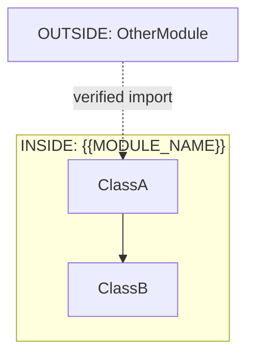
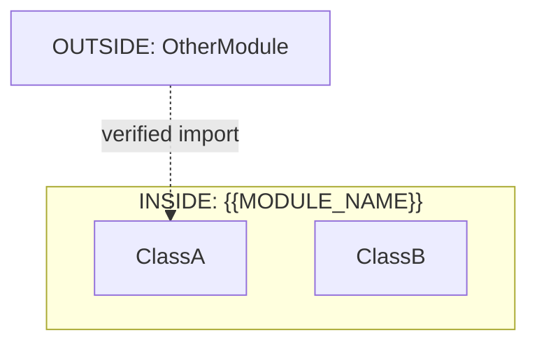

# Round 1 — Architecture & Boundaries (Phase 2)

Analyze internal architecture with explicit INSIDE/OUTSIDE boundaries.

## Anti-Hallucination Rules

**Non-negotiable requirements:**
1. **Read every class** before including in diagram
2. **Verify relationships** by reading actual field assignments
3. **Verify lock types** by reading `synchronized` blocks
4. **Verify design patterns** by reading actual implementation

**FORBIDDEN:**
- Do not infer class relationships from names
- Do not guess lock types without reading the block
- Do not mark something "internal" without reading its source

## Context

**Module Name:** {{MODULE_NAME}}
**Target Directory:** {{TARGET_DIR}}

From anchor (Round 0):
- Core responsibility: {{MODULE_DESCRIPTION}}
- Entry points: {{ENTRY_POINTS}}

## Instructions

### Step 1: Identify Internal Components

READ each class file to identify logical components:
- What is this class responsible for?
- Does it represent a distinct layer/pattern?

### Step 2: Define Module Boundary

```
┌─────────────────────────────────────────────────────────┐
│  INSIDE: {{MODULE_NAME}}                                │
│  [All classes in this module's directory]               │
│                                                         │
│  OUTSIDE: OtherModule                                   │
│  [Calls to classes in other modules - must verify]      │
└─────────────────────────────────────────────────────────┘
```

**INSIDE =** Classes/files in this module's directory
**OUTSIDE =** Any import from another package (verify with actual `import` statement)

### Step 3: Verify Design Patterns

For each pattern claimed:
1. READ the actual implementation
2. Cite the specific lines that implement the pattern
3. Verify the pattern name matches the implementation

| Pattern | Implementation | Source |
|---------|---------------|--------|
| Singleton | `static getInstance()` pattern | File.java:45 |
| Observer | `mListeners.add()` + notify | File.java:67 |

### Step 4: Verify Threading Model

READ synchronization mechanisms:

```java
// Lock verification template
synchronized (this) { ... }  // [Lock: implicit this] - Source: File.java:123
synchronized (mLock) { ... } // [Lock: mLock] - Source: File.java:145
ReentrantLock mLock = new ReentrantLock();
mLock.lock();                // [Lock: mLock] - Source: File.java:167
```

### Step 5: Create Architecture Diagram



**Critical**: Every arrow must be verified from source.

## Anti-Hallucination Checkpoint

```
□ Every class in diagram is verified from actual source
□ Every relationship arrow from actual method call
□ Lock types verified from synchronized blocks
□ Design patterns verified from actual implementation
□ External dependencies from actual import statements
□ Handler threads verified from Looper.prepare()/Handler construction
```

## Output Format

```markdown
# {{MODULE_NAME}} — Architecture Analysis

## Module Boundary

```
INSIDE: {{MODULE_NAME}}
  - All classes in: {{MODULE_DIR}}/

OUTSIDE: OtherModule
  - Verified imports:
    • com.other.Module (File.java:23)
    • com.another.Thing (File.java:24)
```

## Architecture Diagram



## Component Analysis

### Component: <Name>

**Classes in component:** ClassA, ClassB

**Verified responsibilities** (from source):
- ClassA: [Source: FileA.java:42]
- ClassB: [Source: FileB.java:67]

**Verified collaborations** (from actual calls):
| From | To | Method Call | Source |
|------|----|------------|--------|
| ClassA | ClassB | methodX() | FileA.java:89 |

## Design Patterns

| Pattern | Implementation | Source Verified |
|---------|----------------|----------------|
| | | |

## Threading Model

### Locks

| Lock | Type | Acquisition | Source |
|------|------|------------|--------|
| `this` | synchronized | implicit | File.java:123 |
| `mLock` | ReentrantLock | mLock.lock() | File.java:145 |

### Handlers

| Handler | Thread | Messages | Source |
|---------|--------|----------|--------|
| `mH` | main | MESSAGE_WHAT | File.java:67 |

## Cross-Module Calls

| To Module | Call | Source |
|-----------|------|--------|
| OtherModule | service.method() | File.java:89 |

## Anti-Hallucination Log

- [VERIFIED: all class declarations read]
- [VERIFIED: all relationships from actual calls]
- [VERIFIED: lock types from synchronized blocks]
- [UNVERIFIED: list any items not yet verified]
```

## Quality Checklist

- [ ] INSIDE/OUTSIDE boundary clearly defined
- [ ] All diagram components from verified source
- [ ] All arrows from actual method calls
- [ ] Lock types verified
- [ ] Handler threads verified
- [ ] Cross-module boundaries marked

## Output

Append to: `{{TARGET_DIR}}/docs/exploration/{{PROJECT_NAME}}-{{MODULE_NAME}}-deep-dive.md`
