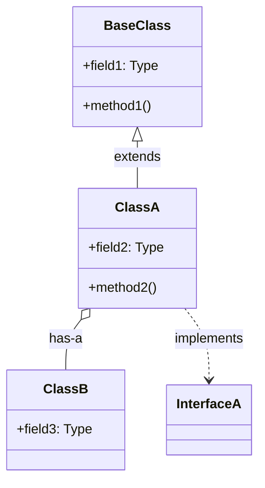

# Round 2 — Class Diagram (Phase 2)

Create verified class diagrams with inheritance, fields, and relationships.

## Anti-Hallucination Rules

**Non-negotiable requirements:**
1. **Read class declaration** before including in diagram
2. **Verify `extends`/`implements`** from actual keywords
3. **Verify field types** from actual field declarations
4. **Verify method signatures** from actual method declarations

**Function-Call Level Depth (REQUIRED for key methods):**
For each key method in the diagram:
1. READ the method body
2. Identify internal calls (same class/private methods)
3. Identify external calls (other classes) → VERIFY by reading those files
4. Identify lock acquisitions → READ synchronized block
5. Identify Binder/Handler usage → READ actual invocation

## Context

**Module Name:** {{MODULE_NAME}}
**Target Directory:** {{TARGET_DIR}}

Key classes from anchor (Round 0):
```
{{KEY_CLASSES}}
```

## Instructions

### Step 1: Verify Class Declarations

For each class, READ the actual declaration:

```java
public class ClassName extends BaseClass implements Interface1, Interface2 { ... }
```

| Verified Item | Source |
|---------------|--------|
| `class ClassName` | File.java:42 |
| `extends BaseClass` | File.java:42 |
| `implements Interface1` | File.java:42 |

### Step 2: Verify Field Declarations

READ each field declaration:

```java
private final HashMap<String, ProcessRecord> mProcessMap;
```

| Field | Exact Type | Modifiers | Source |
|-------|-----------|-----------|--------|
| `mProcessMap` | `HashMap~String,ProcessRecord~` | `private final` | File.java:156 |

### Step 3: Verify Method Signatures

READ each method declaration:

```java
public void startActivity(Intent intent, int userId) { ... }
```

| Method | Visibility | Signature | Source |
|--------|------------|-----------|--------|
| `startActivity` | `public` | `(Intent, int)` | File.java:423 |

### Step 4: Verify Relationships

READ field assignments to verify relationships:

```java
this.mProcessService = processService;  // [Source: File.java:234]
```

### Step 5: Function-Call Depth for Key Methods

For 2-3 critical methods, trace the call chain:

```
Method: startActivity(Intent, int)
Source: ActivityStarter.java:423

1. startActivity()
   └─ 2. startActivityUnchecked() [File.java:489]
       ├─ 3. mRootWindowContainer.resumeFocusedTasks() [RWC.java:234]
       └─ 4. ProcessRecord.bringToForeground() [PR.java:567]
           └─ 5. updateOomAdj() [PR.java:601]
```

## Anti-Hallucination Checkpoint

```
□ Inheritance verified from `extends` keyword
□ Interfaces verified from `implements` keyword
□ Field types verified from actual declarations
□ Method signatures verified from actual declarations
□ Relationships verified from field assignments
□ Key method call chains traced to actual source
□ No relationship drawn without verification
```

## Output Format

```markdown
# {{MODULE_NAME}} — Class Diagram

## Class Hierarchy



## Class Details

### ClassA

**File:** `File.java`
**Line:** 42

**Verified Declaration:**
```java
public class ClassA extends BaseClass implements InterfaceA
```
[Source: File.java:42]

**Verified Fields:**
| Field | Exact Type | Modifiers | Purpose | Source |
|-------|-----------|-----------|---------|--------|
| `mField` | `Type` | `private` | [purpose] | File.java:156 |

**Verified Methods:**
| Method | Visibility | Signature | Purpose | Source |
|--------|------------|-----------|---------|--------|
| `method` | `public` | `(int, String)` | [purpose] | File.java:423 |

**Key Method Analysis: methodName()**

```
Call chain:
1. methodName() [Source: File.java:423]
   └─ 2. internalHelper() [Source: File.java:456]
       └─ 3. ExternalClass.externalMethod() [OtherFile.java:78]
           [Verified: external call]
```

---

## Relationship Map

| From | To | Relationship | Verified From |
|------|----|--------------|---------------|
| ClassA | ClassB | has-a (field) | `private ClassB mB;` File.java:89 |
| ClassA | InterfaceA | implements | `implements InterfaceA` File.java:42 |

## Anti-Hallucination Log

- [VERIFIED: all class declarations read]
- [VERIFIED: all inheritance from `extends` keyword]
- [VERIFIED: all fields from actual declarations]
- [VERIFIED: key method call chains traced]
- [UNVERIFIED: list any items]
```

## Quality Checklist

- [ ] All core classes in diagram
- [ ] Inheritance from actual `extends` keywords
- [ ] Field types exact (no guessing)
- [ ] Method signatures exact
- [ ] Relationships verified from assignments
- [ ] Key methods have call chain depth
- [ ] All sources cited

## Output

Append to: `{{TARGET_DIR}}/docs/exploration/{{PROJECT_NAME}}-{{MODULE_NAME}}-deep-dive.md`
