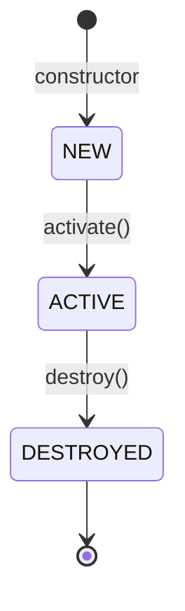

# Round 3 — Data Structures (Phase 2)

Field-level verified data structure documentation.

## Anti-Hallucination Rules

**FIELD-LEVEL ACCURACY IS NON-NEGOTIABLE:**

```
WRONG (guessed):    field1: ProcessRecord  // process reference
CORRECT (verified): mService: IActivityManager  // binder to system service [Source: MyService.java:123]
```

**Requirements:**
1. **READ every field declaration** in the class
2. **Cite exact line numbers** for every field
3. **Verify field types** from actual Generic declarations
4. **Verify state values** from actual assignments

**FORBIDDEN:**
- Do not infer field names from context
- Do not guess field types
- Do not assume state values without reading assignments

## Context

**Module Name:** {{MODULE_NAME}}
**Target Directory:** {{TARGET_DIR}}

Data structures from anchor (Round 0):
```
{{DATA_STRUCTURES}}
```

## Instructions

### Step 1: Verify Class Declaration

READ the full class declaration including Generic types:
```java
public class ProcessRecord extends ConfigurationContainer implements OomAdjusterCallback { ... }
```

### Step 2: Verify ALL Field Declarations

For each field, READ the exact declaration:

```java
// Read from source:
private final HashMap<String, ProcessRecord> mProcessMap;
private int mMaxAdj;
private ProcessRecord mPredecessor;
```

| Field | Exact Type | Modifiers | Source Line |
|-------|-----------|-----------|-------------|
| `mProcessMap` | `HashMap~String,ProcessRecord~` | `private final` | 156 |
| `mMaxAdj` | `int` | `private` | 234 |
| `mPredecessor` | `ProcessRecord` | `private` | 267 |

### Step 3: Identify State Fields

READ where state fields are assigned to identify state machine:

```java
// From source:
mState = STATE_FOREGROUND;  // [Source: File.java:345]
mState = STATE_BACKGROUND;  // [Source: File.java:456]
```

### Step 4: Verify Collection Types

READ Generic declarations for collections:
```java
ArrayMap<String, ActivityRecord> mActivities = new ArrayMap<>();  // [Source: File.java:189]
```

### Step 5: Verify Cross-Module References

Mark but do not explore cross-module references:
```
[OUTSIDE: OtherModule] - mService: IActivityManager - File.java:123
```

## Anti-Hallucination Checkpoint

```
□ Every field has exact type from source
□ Every field has line number citation
□ State values verified from actual assignments
□ Collection Generic types verified
□ Cross-module references marked [OUTSIDE]
□ No field name inferred without reading
```

## Output Format

```markdown
# {{MODULE_NAME}} — Data Structures

## Data Structure: <Name>Record

**File:** `File.java`
**Lines:** [start-end]

**Verified Class Declaration:**
```java
public class XxxRecord extends BaseClass implements Interface { ... }
```
[Source: File.java:42]

**Verified Field Declarations:**
| Field | Exact Type | Modifiers | Source | Purpose |
|-------|-----------|-----------|--------|---------|
| `mField1` | `Type` | `private` | :156 | [verified purpose] |
| `mField2` | `List~Type~` | `private final` | :189 | [verified purpose] |

**Verified Collection Types:**
| Field | Concrete Type | Generic Types | Source |
|-------|--------------|---------------|--------|
| `mMap` | `ArrayMap` | `~String,Record~` | :156 |

**State Fields:**
| Field | Type | Values Verified | Source |
|-------|------|-----------------|--------|
| `mState` | `int` | STATE_FOREGROUND=0, STATE_BACKGROUND=1 | :234 |

### State Machine



**State transitions verified from source:**
- NEW → ACTIVE: `mState = STATE_ACTIVE;` [Source: File.java:345]
- ACTIVE → DESTROYED: `mState = STATE_DESTROYED;` [Source: File.java:456]

---

## Cross-Module References

| Field | Type | Points To | Source |
|-------|------|-----------|--------|
| `mService` | `IActivityManager` | OUTSIDE: ActivityManagerService | :123 |
| `mWindowManager` | `IWindowManager` | OUTSIDE: WindowManagerService | :145 |

## Anti-Hallucination Log

- [VERIFIED: all field declarations read]
- [VERIFIED: all field types from Generic declarations]
- [VERIFIED: state transitions from actual assignments]
- [UNVERIFIED: list any items]
```

## Quality Checklist

- [ ] All fields documented with exact types
- [ ] All fields have source line numbers
- [ ] State machine verified from assignments
- [ ] Collection Generic types verified
- [ ] Cross-module references marked
- [ ] No field name without verification

## Output

Append to: `{{TARGET_DIR}}/docs/exploration/{{PROJECT_NAME}}-{{MODULE_NAME}}-deep-dive.md`
