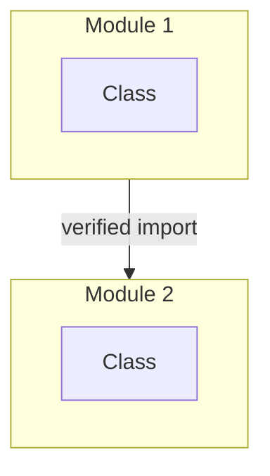

# Round 3 — Module Map Document

Consolidate file inventory and module division into a comprehensive module map.

## Anti-Hallucination Rules

All claims must be verified from source. Use citations from Round 1 and Round 2.

## Inputs

- `{{TARGET_DIR}}/docs/exploration/01-file-inventory.md`
- `{{TARGET_DIR}}/docs/exploration/02-module-division.md`

## Instructions

### Step 1: Create Architecture Overview

Summarize from verified sources:
- Total files: [from Round 1]
- Total modules: [from Round 2]
- Key architectural decisions

### Step 2: Create Module Relationship Diagram

Mermaid flowchart showing verified module relationships:
- Nodes: Modules (from Round 2)
- Edges: Dependencies (verified from `import` statements)

### Step 3: Document Each Module

For each module, consolidate verified information:

```markdown
### Module: <Name>

**Source:** Round 2 verified data
**Files:** [list]
**Responsibility:** [verified from Javadoc]
```

### Step 4: Create Quick Reference Table

| Module | Key Class | Primary Responsibility | Source |
|--------|-----------|----------------------|--------|
| | | | |

### Step 5: Document Exploration Order

With rationale from verified dependencies.

## Output Format

```markdown
# {{PROJECT_NAME}} Module Map

> Generated: {{DATE}}
> Total Files: [count - from Round 1]
> Modules: [count - from Round 2]

## Architecture Overview

[Summary from verified sources]

## Module Relationship Diagram



## Key Modules

### Module: <Name>

**Core Responsibility:** [Source: File.java:line]

**Key Classes:**
| Class | File | Responsibility |
|-------|------|---------------|
| | | |

**Entry Points:**
| Entry Point | File | Type |
|-------------|------|------|
| | | |

**Dependencies:** [from verified imports]
**Exports to:** [from Round 2]

---

## Quick Reference Table

| Module | Key Class | Primary Responsibility |
|--------|-----------|----------------------|
| | | |

## Exploration Order

1. **<Module>** — [rationale]
2. **<Module>** — [rationale]

## Cross-Module Boundaries

| Boundary | Bridging Files | Verified From |
|----------|---------------|---------------|
| | | |

## Anti-Hallucination Verification

- All module responsibilities verified: [yes]
- All dependencies from `import` statements: [yes]
- All entry points from method signatures: [yes]
```

## Quality Checklist

- [ ] Architecture overview matches verified file structure
- [ ] Mermaid diagram matches verified module relationships
- [ ] No unverified claims in module descriptions
- [ ] Exploration order justified from dependencies
- [ ] Cross-module boundaries documented

## Output

Write to: `{{TARGET_DIR}}/docs/exploration/{{PROJECT_NAME}}-module-map.md`

Then update ledger at: `{{TARGET_DIR}}/.exploration/ledger.md`
