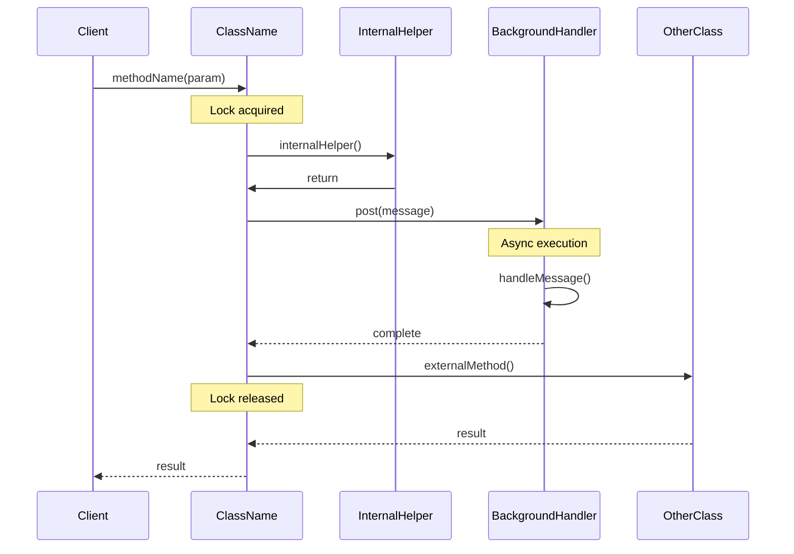

# Round 4 — Function Call Chains (Phase 2)

LINE-BY-LINE verified call chains for entry points.

## ⚠️ THIS IS THE CORE OF THE SKILL. FUNCTION-CALL DEPTH IS NON-NEGOTIABLE.

## Anti-Hallucination Rules

**MANDATORY FOR EVERY METHOD IN THE CHAIN:**

1. **READ the method body** before claiming it does anything
2. **READ the called method** before claiming what it does
3. **VERIFY every call** by reading the actual invocation
4. **VERIFY every parameter** by reading the actual call site
5. **VERIFY every lock** by reading the synchronized block

**TEMPLATE:**
```
❌ WRONG: method() calls helper() which updates state
✓ CORRECT: method() [Source: File.java:423]
   └─ 2. helper() [Source: File.java:456]
       └─ 3. state = NEW_VALUE [Source: File.java:489] [Lock: mLock]
```

## Context

**Module Name:** {{MODULE_NAME}}
**Target Directory:** {{TARGET_DIR}}

Entry points from anchor (Round 0):
```
{{ENTRY_POINTS}}
```

## Instructions

### Step 1: Select Entry Points

Choose 2-4 most critical entry points:
- Binder methods (cross-process)
- Public API methods
- High-level orchestration methods

### Step 2: Trace Call Chain

For EACH selected entry point:

```
1. Read the entry point method body (ENTIRE method)
2. For each call in the method:
   a. READ the called method body
   b. If internal (same class): continue reading
   c. If external (other class): VERIFY by reading that file
   d. Continue until core logic reached
3. Document with exact line numbers
```

### Step 3: Verify All Annotations

For each step, verify:

| Annotation | How to Verify |
|------------|---------------|
| Thread | Where is this called from? |
| Lock | Read `synchronized` block or `lock.lock()` |
| Type (SYNC/ASYNC) | Direct call = SYNC, Handler.post() = ASYNC |
| Parameters | From actual call site |

### Lock Verification (MANDATORY)

```java
// Read synchronized method:
public synchronized void method() { }  // [Lock: implicit this]

// Read synchronized block:
synchronized (mGlobalLock) { ... }  // [Lock: mGlobalLock]

// Read ReentrantLock:
mLock.lock();  // [Lock: mLock]
mLock.unlock();
```

### Handler Verification (MANDATORY)

```java
// Read Message creation:
Message msg = Message.obtain();  // [Async: Handler.post()]
msg.what = MESSAGE_WHAT;

// Read send:
mHandler.sendMessage(msg);  // [Async: mH.sendMessage(msg.what=MESSAGE_WHAT)]

// Read handler callback:
public void handleMessage(Message msg) {
    switch (msg.what) {  // Verified: MESSAGE_WHAT handling
        case MESSAGE_WHAT: ...
    }
}
```

### Binder Verification (MANDATORY)

```java
// Read interface call:
mService.method(params);  // [Binder: IActivityManager.method()]

// Verify interface from AIDL:
interface IActivityManager {
    void method(params);  // [Source: IActivityManager.aidl]
}
```

## Call Chain Template

```markdown
## Call Chain: methodName()

**Entry Point:** `ClassName.methodName(params)`
**Source:** File.java:423
**Thread:** main
**Lock:** mGlobalLock (acquired at :445, released at :512)

### Happy Path

```
1. ClassName.methodName(param1, param2)
   [Source: File.java:423]
   Thread: main | Lock: mGlobalLock (acquired at line 445)
   └─ 2. internalHelper(param1)
        [Source: File.java:456]
        Thread: main | Lock: NONE
        ├─ 3. ⏰ Handler.post(Message)
        │     [Source: File.java:478]
        │     [Async: mH.sendMessage(msg.what=MESSAGE_WHAT)]
        │     └─ 4. HandlerCallback.handleMessage()
        │           [Source: File.java:523]
        │           └─ 5. processAsync()
        │                [Source: File.java:534]
        │
        └─ 6. OtherClass.externalMethod()
             [Source: File.java:489]
             [Binder: IOtherInterface.method()]
             [Waits for result]
             └─ 7. return result
```

### Key Decisions Along the Path

| Step | Decision | Condition | Action | Source |
|------|----------|-----------|--------|--------|
| 1 | Check null | `obj == null` | return ERROR | :445 |
| 3 | Post async | `!isMainThread` | Queue message | :478 |

### Lock Ordering

1. `mGlobalLock` acquired at step 1, released after step 5
2. No nested locks in this path

### Data Modifications

| Step | Data Structure | Field | New Value | Source |
|------|---------------|-------|-----------|--------|
| 5 | ProcessRecord | mState | STATE_ACTIVE | :534 |

---

## Anti-Hallucination Checkpoint

```
□ Every method name verified from source
□ Every line number is accurate (source read at that line)
□ Lock type verified by reading synchronized block
□ Handler message type verified by reading Message.obtain()
□ Binder calls verified by reading actual interface usage
□ Return types verified from method signatures
□ Parameters verified from actual call site
□ Error paths verified by reading try/catch/if blocks
□ No call claimed without reading the actual source
```

## Sequence Diagram (from call chain)



## Quality Checklist

- [ ] 2-4 entry points analyzed
- [ ] All calls traced to actual source
- [ ] Thread context for each call
- [ ] Lock acquisition/release points marked
- [ ] Handler/Binder calls annotated
- [ ] Error paths covered
- [ ] Sequence diagram included
- [ ] All sources cited

## Output

Append to: `{{TARGET_DIR}}/docs/exploration/{{PROJECT_NAME}}-{{MODULE_NAME}}-deep-dive.md`
