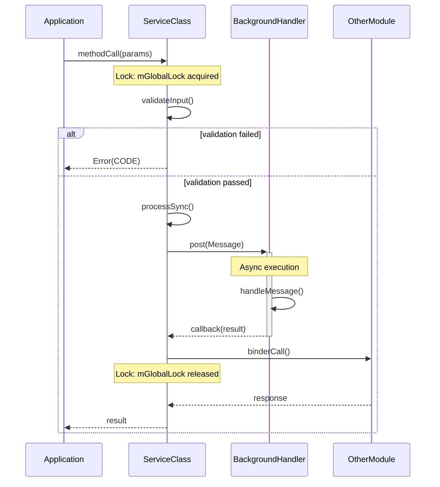
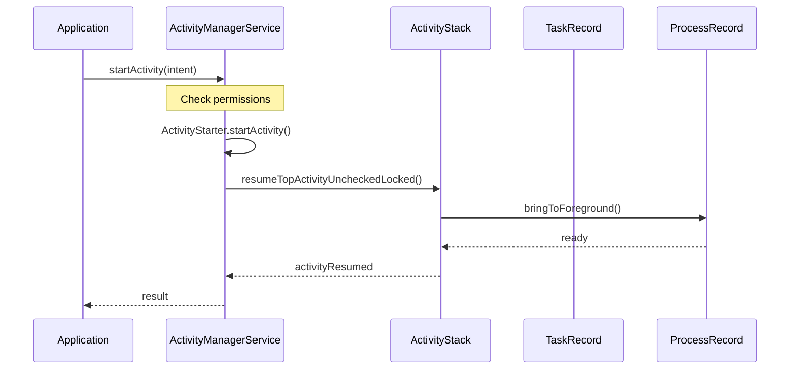
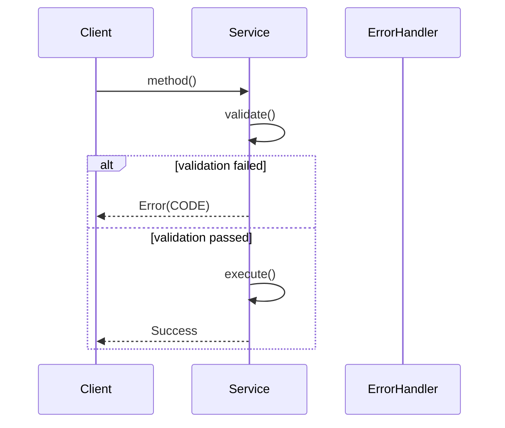

# Round 5 — Sequence Diagrams & Key Scenarios Prompt

Create detailed sequence diagrams for the key scenarios in this module.

## ⚠️ ANTI-HALLUCINATION RULES (MANDATORY)

**Non-negotiable requirements:**
1. **READ every method** in the sequence before including it
2. **VERIFY message passing** from actual method calls
3. **VERIFY async points** from actual Handler.sendMessage() or Binder calls
4. **VERIFY lock ordering** from actual synchronized blocks
5. **VERIFY data changes** from actual field assignments

**FORBIDDEN:**
- Do not invent sequence steps without reading source
- Do not guess which thread handles messages
- Do not assume lock names without reading synchronized blocks
- Do not claim async behavior without verifying Handler usage

## Module to Explore

**Module Name:** {{MODULE_NAME}}

**Target Directory:** {{TARGET_DIR}}

## Context

Key scenarios from call chains (Round 4):
- {{SCENARIOS}}

## Instructions

For each important scenario:

1. **Main happy path**
   - Create Mermaid sequence diagram
   - Include all participating objects/classes
   - Show timing/ordering

2. **Edge / error / lifecycle paths**
   - If applicable, show alternate paths

3. **For each diagram, document:**
   - Important conditions
   - Async points (Handler posts, Binder calls)
   - Key data structure changes
   - Synchronization points
   - Potential race conditions

4. **Summarize sync points and race conditions**
   - Where locks are held
   - Where async operations occur
   - Where race conditions could occur

## Anti-Hallucination Checkpoint

```
□ Every method in sequence is read from source
□ Message passing verified from actual call sites
□ Async points verified from Handler.sendMessage() calls
□ Binder calls verified from interface usage
□ Lock names verified from synchronized blocks
□ Data changes verified from actual field assignments
□ Thread names verified from Looper.getMainLooper() or Thread.currentThread()
□ No sequence step invented without source verification
```

## Sequence Diagram Template



## Verification Table

| Diagram Element | Verify From | Source |
|-----------------|-------------|--------|
| Method calls | Actual invocation | File.java:LINE |
| Lock acquired | synchronized block | File.java:LINE |
| Lock released | End of synchronized | File.java:LINE |
| Async post | Handler.sendMessage() | File.java:LINE |
| Async handle | handleMessage switch | File.java:LINE |
| Binder call | Interface method | File.java:LINE |
| Data change | Field assignment | File.java:LINE |

---

## Output Format

```markdown
# {{MODULE_NAME}} — Sequence Diagrams

## 1. Scenario: ScenarioName

### Overview
[Brief description of what this scenario represents]

### Happy Path Sequence



### Key Steps

| Step | Action | Async? | Data Changed | Verified From |
|------|--------|--------|-------------|---------------|
| 1 | Check permissions | No | - | AMS.java:234 |
| 2 | Create Activity record | No | ActivityRecord | Starter.java:456 |
| 3 | Resume activity | Yes | Activity state | Stack.java:123 |

### Synchronization Points

- **Step 1-2:** Held `mGlobalLock` [Source: AMS.java:200-250]
- **Step 3:** Async, no lock held
- **Step 4:** Released lock, posted to handler

### Potential Race Conditions

| Condition | Trigger | Mitigation | Verified From |
|-----------|---------|------------|---------------|
| Activity destroyed during resume | Client calls finish() | Check state before resume | Stack.java:456 |

---

## 2. Scenario: AnotherScenario

[Same format...]

---

## 3. Error Scenario: ErrorCondition

### Overview
[What error this handles]

### Error Sequence



---

## 4. Summary: Sync Points & Race Conditions

### Locks and Critical Sections

| Lock | Purpose | Duration | Held By | Verified From |
|------|---------|----------|---------|---------------|
| `mGlobalLock` | Global state | Steps 1-5 | AMS main thread | AMS.java:200 |

### Async Boundaries

| Operation | Type | Waits For | Verified From |
|-----------|------|-----------|---------------|
| Handler.post() | Async | Background thread | Service.java:123 |

### Race Conditions

| Race | Condition | Impact | Prevention | Verified From |
|------|----------|--------|------------|---------------|
| State change during read | No lock | Stale data | Check state atomically | Record.java:234 |
```

## Quality Checklist

- [ ] 2+ key scenarios covered
- [ ] Each has Mermaid sequence diagram
- [ ] Async points clearly marked with verified Handler.sendMessage()
- [ ] Sync points documented with verified synchronized blocks
- [ ] Race conditions identified with source citations
- [ ] Error scenarios included with verified error paths
- [ ] All diagram elements verified from source

## Output

Append to the module deep-dive document:
```
{{TARGET_DIR}}/docs/exploration/{{PROJECT_NAME}}-{{MODULE_NAME_LOWER}}-deep-dive.md
```
