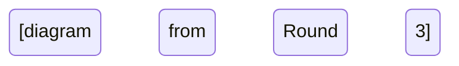

# Round 6 — Module Summary Document Prompt

Consolidate all previous analysis (Rounds 0-5) into a comprehensive module deep-dive document.

## ⚠️ ANTI-HALLUCINATION RULES (MANDATORY)

**Non-negotiable requirements:**
1. **VERIFY all sources** from previous rounds are cited
2. **VERIFY all diagrams** match the source code documented
3. **VERIFY all field names** from actual declarations
4. **VERIFY all method names** from actual signatures
5. **VERIFY all lock names** from actual synchronized blocks

**FORBIDDEN:**
- Do not invent new facts not in previous rounds
- Do not change field names that were verified
- Do not claim class relationships without verification
- Do not omit verified sources from citations

## Module to Explore

**Module Name:** {{MODULE_NAME}}

**Target Directory:** {{TARGET_DIR}}

## Input

All previous rounds for this module (MUST cite sources from):
- Round 0: Anchor (core responsibility, key classes, entry points)
- Round 1: Architecture analysis
- Round 2: Class diagram
- Round 3: Data structures
- Round 4: Call chains
- Round 5: Sequence diagrams

## Instructions

Consolidate all analysis into a single comprehensive document with these sections:

1. Module Architecture
2. Class Diagram (Mermaid)
3. Key Data Structures (detailed)
4. Core Function Call Chains (function-level)
5. Sequence Diagrams (key scenarios)
6. State Machines (if any)
7. Cross-Module Interactions
8. Locks, Threads, and Concurrency Notes
9. Common Pitfalls & Debugging Tips
10. Suggested Follow-up Exploration Points

## Anti-Hallucination Checkpoint

```
□ All sources from previous rounds are cited
□ All field names match verified declarations
□ All method names match verified signatures
□ All lock names match verified synchronized blocks
□ All class relationships verified from extends/implements
□ No new facts without source verification
□ All diagrams match documented source code
```

## Output Format

```markdown
# {{MODULE_NAME}} Deep Dive

> Module: {{MODULE_NAME}}
> Explored: {{DATE}}
> Files Analyzed: {{COUNT}}

## 1. Module Architecture

[From Round 1 - architecture analysis]

### 1.1 Overview
[Core responsibility]

### 1.2 Components
[Internal components and their collaboration]

### 1.3 Architecture Diagram

```mermaid
flowchart TB
    [diagram from Round 1]
```

---

## 2. Class Diagram

[From Round 2]

```mermaid
classDiagram
    [diagram from Round 2]
```

### 2.1 Key Classes

| Class | File | Verified From |
|-------|------|---------------|
| ClassName | File.java | Round 2:456 |

### 2.2 Verified Class Relationships

| Relationship | Verified From |
|--------------|---------------|
| ClassA extends BaseClass | File.java:42 |
| ClassA implements Interface | File.java:42 |

---

## 3. Key Data Structures

[From Round 3]

### 3.1 XxxRecord

| Field | Exact Type | Verified From |
|-------|-----------|---------------|
| field1 | Type | File.java:156 |

### 3.2 State Machine



### 3.3 Verified State Transitions

| Transition | Condition | Source |
|------------|-----------|--------|
| NEW → ACTIVE | mState = STATE_ACTIVE | File.java:234 |

---

## 4. Core Function Call Chains

[From Round 4]

### 4.1 Entry Point: methodName()

```
[ASCII call chain from Round 4 - all sources verified]
```

### 4.2 Verified Call Chain Details

| Step | Method | Source | Thread | Lock |
|------|--------|--------|--------|------|
| 1 | methodName() | File.java:100 | main | mLock |

---

## 5. Sequence Diagrams

[From Round 5]

### 5.1 Scenario: ScenarioName

```mermaid
sequenceDiagram
    [diagram from Round 5 - all steps verified]
```

---

## 6. State Machines

[From Round 3 - all state diagrams consolidated]

---

## 7. Cross-Module Interactions

[From all rounds - consolidated]

### 7.1 Dependencies

| Module | Verified From |
|--------|---------------|
| OtherModule | import statement - File.java:23 |

### 7.2 Interface Contracts

| Interface | Methods | Contract | Verified From |
|-----------|---------|----------|---------------|
| `Interface` | method1, method2 | [description] | File.java:456 |

---

## 8. Locks, Threads, and Concurrency

[From all rounds - consolidated]

### 8.1 Lock Hierarchy

```
1. mGlobalLock (outer) - Verified: File.java:200
2. mProcLock (inner) - Verified: File.java:300
```

### 8.2 Thread Model

| Thread | Purpose | Verified From |
|--------|---------|---------------|
| Main thread | [what it does] | Looper.java |

### 8.3 Race Conditions

| Condition | Location | Mitigation | Verified From |
|-----------|----------|------------|---------------|
| [race] | [location] | [mitigation] | File.java:234 |

---

## 9. Common Pitfalls & Debugging Tips

### 9.1 Pitfalls

| Pitfall | Symptom | Solution | Verified From |
|---------|---------|----------|---------------|
| [pitfall] | [symptom] | [solution] | File.java:123 |

### 9.2 Debugging Commands

```bash
# [useful commands - verified they exist]
adb shell dumpsys activity processes
```

### 9.3 Key Log Tags

| Tag | What It Logs | Verified From |
|-----|-------------|---------------|
| tag1 | [what it logs] | File.java:123 |

---

## 10. Suggested Follow-up Exploration

1. **Module X** — [why related]
2. **Module Y** — [why related]

---

## Appendix: File Reference

| File | Lines | Purpose | Round Verified |
|------|-------|--------|----------------|
| `File.java` | N | [purpose] | R0 |
```

## Quality Checklist

- [ ] All 10 sections present
- [ ] Architecture flowchart included with verified components
- [ ] Class diagram included with verified relationships
- [ ] Data structures fully documented with verified field names
- [ ] Call chains detailed with verified sources
- [ ] Sequence diagrams included with verified steps
- [ ] State machines visualized with verified transitions
- [ ] Cross-module boundaries marked with verified imports
- [ ] Debugging tips practical and verified
- [ ] All sources cited from previous rounds

## Output

Write the complete summary to:
```
{{TARGET_DIR}}/docs/exploration/{{PROJECT_NAME}}-{{MODULE_NAME_LOWER}}-deep-dive.md
```

Then update the ledger at `{{TARGET_DIR}}/.exploration/ledger.md` to mark this module complete.
