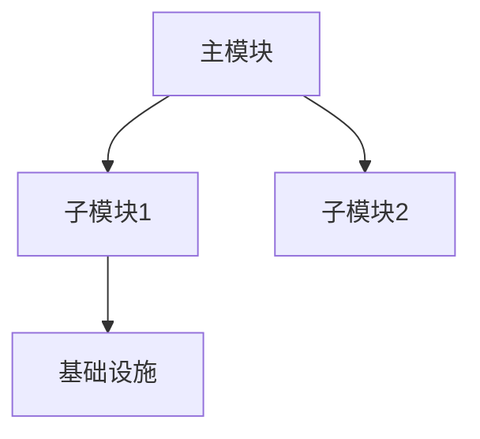

# L1: 宏观架构分析 Prompt

## 任务
分析代码仓库 `{repo_path}` 的宏观架构。

## 仓库类型
`{repo_type}` (kernel/android/userspace/rust)

## 仓库签名
```javascript
const signatures = {
  kernel: ['Kconfig', 'Makefile', 'arch/*/Kconfig', 'init/Kconfig'],
  android: ['Android.bp', 'Android.mk', 'frameworks/', 'packages/'],
  userspace: ['CMakeLists.txt', 'meson.build', 'configure.ac'],
  rust: ['Cargo.toml', 'src/lib.rs', 'src/bin/'],
}
```

## 分析要求

### 1. 模块划分
- 识别核心模块 (目录结构 + 功能)
- 模块间依赖关系
- 入口点识别 (main/SYSCALL/ioctl)

### 2. 内核子系统关系 (如适用)
- 与内核 VM/IRQ/Sync 层的交互
- 驱动模型 (platform/pci/usb)
- 中断处理机制

### 3. 输出架构图
使用 Mermaid flowchart 描述模块关系:


## 输出格式
- 模块职责表
- 依赖关系图
- 关键入口点清单

## 源码验证
所有结论必须引用实际源码路径和行号
