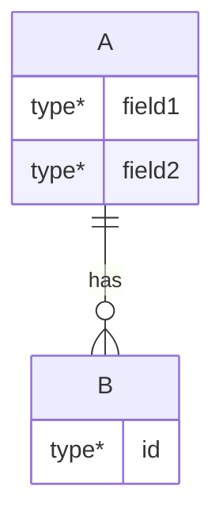

# L2: 核心数据结构分析 Prompt

## 任务
分析 `{repo_path}` 的核心数据结构。

## 仓库类型
`{repo_type}`

## 分析要求

### 1. 结构体识别
使用规则扫描:
```javascript
const patterns = {
  struct: /struct\s+\w+\s*\{[^}]+\}/g,
  enum: /enum\s+\w+\s*\{[^}]+\}/g,
  list: /list_head|rb_node|crypto_link/,
  refcount: /refcount_t|atomic_t|kref/,
};
```

### 2. 字段分类
- 基础字段 (int, pointer, array)
- 链表字段 (list_head, rb_node)
- 引用计数 (atomic_t, refcount_t)
- 锁字段 (spinlock_t, mutex)
- 回调字段 (ops, callback, func_ptr)

### 3. 关系图
使用 Mermaid ER 图描述结构关系:


### 4. 生命周期
- 分配方式 (kmalloc/vmalloc/kmem_cache)
- 初始化模式 (init/constructor)
- 释放路径 (kfree/destructor)

## 输出格式
- 结构体清单 + 字段表
- ER 关系图
- 生命周期流程图
