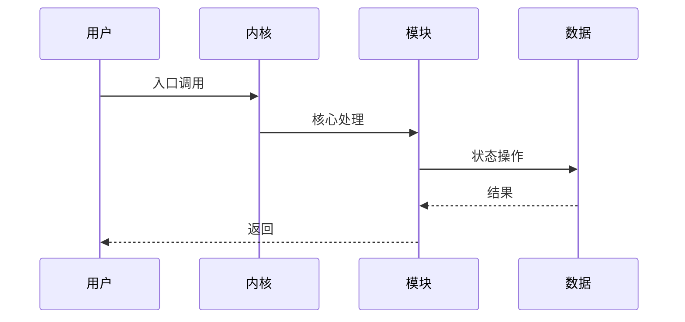

# L3: 关键路径分析 Prompt

## 任务
分析 `{repo_path}` 的关键执行路径: `{path_name}`

## 路径描述
`{path_description}`

## 分析要求

### 1. 入口识别
```javascript
const entryPatterns = {
  syscall: /SYSCALL_DEFINE|sys_/,
  ioctl: /ioctl|compat_ioctl/,
  callback: /_ops\.|->\w+_cb/,
  interrupt: /irq_handler|interrupt/,
};
```

### 2. 调用链追踪
- 从入口向下追踪每个关键函数调用
- 识别分支条件 (if/switch)
- 记录锁获取/释放点

### 3. 时序图


### 4. 源码对照
每个步骤必须包含:
- 函数名 + 行号
- 关键代码片段
- 锁状态变化

## 输出格式
- 完整调用链
- Mermaid 时序图
- 源码对照表
