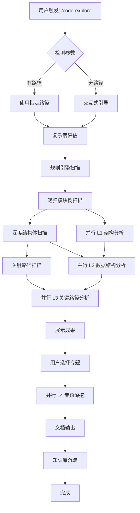

# Code Explore: 复杂代码仓库深度探索框架

## 概述

本 skill 用于对复杂代码仓库进行系统性的深度探索，输出与仓库规模匹配的详细分析文档。采用**规则引擎 + LLM 驱动**的混合架构，实现效率与深度的平衡。

**核心改进**: 支持递归深度挖掘，模块颗粒度、数据结构数量、关键路径数量与仓库规模成正比。

## 核心设计

### 1. 自适应仓库规模评估

```
规模评估 → 复杂度标签 → 递归深度调整 → 输出规模匹配
```

| 复杂度 | 指标 | L1-L4 执行策略 | 预期输出 |
|--------|------|----------------|----------|
| simple | < 20 文件, < 10 struct | L1+L2 精简版 | ~5 模块, ~10 struct, ~3 路径 |
| medium | < 200 文件, < 100 struct | 完整 4 层 | ~20 模块, ~50 struct, ~10 路径 |
| complex | < 2000 文件, < 500 struct | 完整 4 层 + 子专题并行 | ~50 模块, ~200 struct, ~30 路径 |
| massive | > 2000 文件, > 500 struct | 完整 4 层 + 深度递归 + 专题并行 | ~100+ 模块, ~500+ struct, ~50+ 路径 |

### 2. 混合引擎架构

| 层级 | 引擎 | 任务 |
|------|------|------|
| **L1 宏观架构** | 规则引擎 + LLM | 递归模块树扫描 + 依赖关系分析 |
| **L2 核心数据结构** | 规则引擎 + LLM | 深度结构体扫描 + 语义解读 |
| **L3 关键路径** | LLM (parallel) | 调用链追踪 + 时序分析 |
| **L4 专题深挖** | LLM (parallel) | 6 专题：并发/内存/安全/错误/性能/版本 |

### 3. LIB 模块清单

```
LIB/
├── scale-assessment.js      # 复杂度评估 (排除非源码文件)
├── repo-detection.js        # 仓库类型检测 (C++/Android 权重)
├── memory-writer.js         # 知识沉淀
├── module-tree-scanner.js   # 递归模块树扫描器
├── struct-scanner.js        # 深度结构体扫描器
└── path-finder.js           # 关键路径挖掘器
```

## 执行流程



## L1: 宏观架构分析

### 规则引擎扫描

使用 `module-tree-scanner.js` 递归扫描：

```javascript
// 扫描配置
const options = {
  maxDepth: 4,              // 递归深度
  excludeDirs: ['.git', 'test', 'tests', 'benchmark', 'build', 'out'],
  includeExtensions: ['.h', '.cc', '.cpp', '.c', '.java', '.kt'],
  minFilesPerModule: 1,
  minLinesPerModule: 100,
};

// 输出
{
  modules: [
    { name, path, depth, fileCount, lineCount },
    ...
  ],
  keyModules: [...],  // 按重要性分数排序
  dependencies: {...} // #include 依赖关系
}
```

### 关键模块识别算法

```javascript
// 重要性分数 = 文件数分数(40%) + 行数分数(40%) + 深度分数(20%)
function calculateImportance(mod, totalStats) {
  const fileScore = (mod.fileCount / totalStats.fileCount) * 40;
  const lineScore = (mod.lineCount / totalStats.lineCount) * 40;
  const depthScore = Math.min(mod.depth / 6, 1) * 20;
  return fileScore + lineScore + depthScore;
}
```

### 输出

- `docs/{repo}-architecture.md`
- 架构图 + 模块职责表 + 依赖关系

## L2: 核心数据结构

### 规则引擎扫描

使用 `struct-scanner.js` 深度扫描：

```javascript
// 扫描配置
const options = {
  maxDepth: 5,              // 递归深度
  extensions: ['.h', '.cc', '.cpp', '.c', '.java', '.kt'],
  minFields: 1,             // 最少字段数
};

// 输出
{
  allStructs: [
    {
      name, kind, file, line,
      fields: [{ name, type, category, isPointer }],
      methods: [...],
      baseClasses: [...],
      fieldCount, size
    },
    ...
  ],
  groups: { core: [], memory: [], thread: [], io: [], ... },
  stats: { total, byKind, byCategory, topByFields }
}
```

### 字段类型分类

| 类型 | 特征 | 示例 |
|------|------|------|
| pointer | 含 `*` 或 `&` | `void *`, `char &` |
| lock | 含 spinlock/mutex/lock | `spinlock_t` |
| list | 含 list_head/rb_ | `struct list_head` |
| atomic | 含 refcount/atomic | `refcount_t` |
| primitive | 基础类型 | `int`, `bool`, `char` |
| callback | 含 callback/ops/func | `ops`, `func_ptr` |

### 输出

- `docs/{repo}-data-structures.md`
- 结构关系图 + 字段表 + 生命周期

## L3: 关键路径分析

### 规则引擎扫描

使用 `path-finder.js` 追踪调用链：

```javascript
// 扫描配置
const options = {
  repoType: 'kernel',  // kernel | android | userspace | rust
  maxFiles: 100,
  maxDepth: 5,
};

// 输出
{
  callPaths: [
    { entry: 'binder_transaction', chain: [...], depth: 8 },
    ...
  ],
  coreFlows: [
    { name: 'VFS 操作流程', keywords: [...], occurrences: 50 },
    ...
  ],
  stats: { totalPaths, maxDepth, totalFlows }
}
```

### 入口点识别模式

| 仓库类型 | 入口模式 |
|----------|----------|
| kernel | `init_module`, `probe`, `open`, `read`, `write`, `ioctl` |
| android | `onCreate`, `onTransact`, `handleMessage`, `native*` |
| userspace | `main`, `run`, `process`, `handle` |
| rust | `main`, `run`, `new`, `spawn` |

### 输出

- `docs/{repo}-critical-paths.md`
- 每个路径独立 .md 文件
- 整合 HTML 报告

## L4: 专题深挖

### 6 大专题

| 专题 | 分析内容 | 适用场景 |
|------|----------|----------|
| **并发与同步** | 锁机制、竞态模式、死锁分析 | 内核驱动、多线程库 |
| **内存管理** | 分配器、GC、缓存、OOM | 内存密集型系统 |
| **安全与权限** | 访问控制、Sandbox、漏洞模式 | 权限管理、安全相关 |
| **错误处理** | 错误传播、恢复机制、调试 | 稳定性分析 |
| **性能瓶颈** | 热点分析、延迟分布、优化点 | 性能调优 |
| **版本演进** | API 变更、兼容性、迁移 | 长期维护 |

### 专题选择交互

```
发现以下专题可能适用:
1. [ ] 并发与同步
2. [ ] 内存管理  
3. [ ] 安全与权限
4. [ ] 错误处理
5. [ ] 性能瓶颈
6. [ ] 版本演进

请选择需要深挖的专题 (多选) 或输入 [all] 全部分析:
```

## 双轨输出

### 1. 文档输出 (docs/)

```
docs/
├── {repo}-architecture.md          # L1 架构报告
├── {repo}-data-structures.md       # L2 数据结构报告  
├── {repo}-critical-paths.md        # L3 关键路径报告
├── {repo}-topics/                  # L4 专题分析
│   ├── concurrency-sync.md
│   ├── memory-management.md
│   └── ...
└── {repo}-MASTER-GUIDE.html        # 整合 HTML 报告
```

### 2. 知识库沉淀 (memory/)

```markdown
---
name: {repo}-{concept}
description: {一句话描述}
metadata:
  type: reference
---

# {概念名}

## 核心要点
- 要点1
- 要点2

## 源码位置
- {file}:{line}

## 相关概念
- [[related-concept]]

**Why:** {为什么这个知识重要}
**How to apply:** {如何在其他场景应用}
```

## 自适应策略

### 仓库类型检测

```javascript
const repoSignatures = {
  kernel: ['Kconfig', 'Makefile', 'arch/*/Kconfig', 'init/Kconfig'],
  android: ['Android.bp', 'Android.mk', 'frameworks/', 'packages/'],
  userspace: ['CMakeLists.txt', 'meson.build', 'configure.ac'],
  rust: ['Cargo.toml', 'src/lib.rs', 'src/bin/'],
}
```

### 复杂度评估

```javascript
// 排除非源码文件
const SOURCE_EXTENSIONS = ['.c', '.h', '.cc', '.cpp', '.java', '.kt', '.rs', '.go'];
const IGNORE_DIRS = ['.git', 'test', 'tests', 'benchmark', 'build', 'out', 'docs'];

// 评估标准
const complexity = {
  simple: { maxFiles: 20, maxStructs: 10 },
  medium: { maxFiles: 200, maxStructs: 100 },
  complex: { maxFiles: 2000, maxStructs: 500 },
  // 超过 complex 即为 massive
};
```

### 模式适配

| 仓库类型 | L1 重点 | L2 重点 | L4 建议专题 |
|----------|---------|---------|-------------|
| kernel | 系统调用、驱动模型 | struct list_head, VM | 并发、安全、性能 |
| android | Binder, AMS, PMS | IBinder, Parcel | 安全、性能 |
| userspace | 库架构、插件系统 | 对象关系 | 错误处理、版本 |
| rust | trait system, borrow | struct, enum match | 内存安全、并发 |

## 触发方式

### 方式 1: 路径指定 (优先)

```
/code-explore /path/to/repo [--module <module>] [--topics <topic1,topic2>]
```

### 方式 2: 交互式引导 (无参数时)

```
> /code-explore
请输入代码仓库路径: ~/linux/drivers
分析模块 (可选,直接回车分析全部): binder
发现复杂仓库, 是否使用精简配置? [y/N]:
```

## 实施清单

- [x] 创建 `~/.claude/skills/code-explore/SKILL.md`
- [x] 编写 `WORKFLOW.md` 工作流脚本模板
- [x] 实现复杂度评估函数 (scale-assessment.js)
- [x] 实现仓库类型检测逻辑 (repo-detection.js)
- [x] 实现知识沉淀 (memory-writer.js)
- [x] 实现递归模块树扫描器 (module-tree-scanner.js)
- [x] 实现深度结构体扫描器 (struct-scanner.js)
- [x] 实现关键路径挖掘器 (path-finder.js)
- [ ] 在 ART 仓库测试完整流程
- [ ] 在 Binder 仓库测试完整流程
- [ ] 优化输出格式与颗粒度匹配

## 预期输出对比

| 仓库 | 复杂度 | 模块数 | Struct 数 | 路径数 |
|------|--------|--------|-----------|--------|
| BCC 盲测 | medium | ~20 | ~50 | ~10 |
| ART Runtime | massive | ~100+ | ~500+ | ~50+ |
| Binder Driver | complex | ~50 | ~200 | ~30 |

---
*Last updated: 2026-08-06 - 添加递归深度扫描模块*
