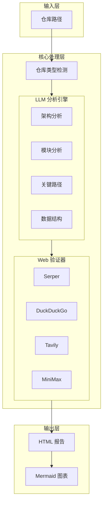
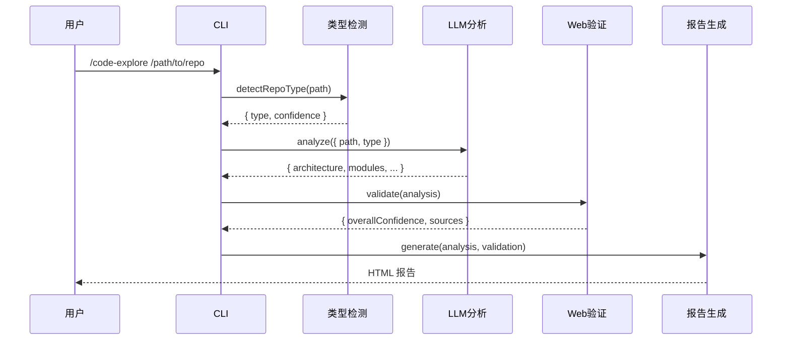

# code-explore 架构文档

> 本文档描述 code-explore skill 的 LLM 驱动架构设计

[知识来源: 基于训练数据]

## 概述

code-explore 是一个 LLM 驱动的代码仓库分析工具，采用 Plan-Act-Reflect 循环模式实现语义级别的代码理解。

## 架构图



## 核心模块

### 1. 仓库类型检测 (`LIB/repo-detection.js`)

**功能**: 根据仓库特征识别仓库类型

**检测逻辑**:
- 检查 Makefile / Kbuild 文件 → `kernel`
- 检查 `art/` 目录 + `dalvik/` → `art`
- 检查 `frameworks/` + `packages/` → `android`
- 检查 `build.gradle` / `pom.xml` → `java`
- 检查 `Cargo.toml` → `rust`
- 检查 `go.mod` → `go`

**接口**:
```javascript
async function detectRepoType(repoPath): Promise<{
  type: string,
  confidence: number,
  recommendedTopics?: string[]
}>
```

### 2. LLM 分析器 (`LIB/llm-analyzer.js`)

**功能**: 使用 LLM 进行语义级别的代码分析

**分析阶段**:

| 阶段 | 描述 | 输出 |
|------|------|------|
| 架构分析 | 识别架构模式、组件、依赖关系 | `architecture` |
| 模块分析 | 识别核心模块、接口、复杂度 | `modules` |
| 关键路径 | 追踪入口函数、调用链 | `criticalPaths` |
| 数据结构 | 分析核心数据结构、设计模式 | `dataStructures` |

**接口**:
```javascript
class LLMAnalyzer {
  constructor(options: { model?: string, maxTokens?: number })
  async analyze(repoInfo: { path: string, type: string }): Promise<AnalysisResult>
}
```

### 3. Web 验证器 (`LIB/web-validator.js`)

**功能**: 多引擎并行搜索验证 LLM 结论

**验证引擎**:

| 引擎 | 权重 | 用途 |
|------|------|------|
| Serper | 0.30 | Google 搜索，权威文档 |
| Tavily | 0.25 | 技术深度、学术论文 |
| DDG | 0.25 | 开发者社区 |
| Claude | 0.20 | 中文社区 |

**置信度计算**:
```javascript
// 加权平均
confidence = Σ(engine_confidence × weight) / Σ(weight)
```

**接口**:
```javascript
class WebValidator {
  constructor(options: { confidenceThreshold?: number })
  async validate(analysis: AnalysisResult): Promise<ValidationResult>
}
```

### 4. 报告生成器 (`LIB/report-generator.js`)

**功能**: 生成交互式 HTML 报告

**模板引擎**: SimpleTemplate（轻量级 Handlebars 风格）

**支持语法**:
- `{{variable}}` - 变量替换
- `{{#if condition}}...{{/if}}` - 条件块
- `{{#each items}}...{{/each}}` - 循环块

**输出格式**:
- HTML + Mermaid 图表
- 深色主题（GitHub 风格）
- 响应式布局

## 数据流



## 错误处理

### 降级策略

| 场景 | 降级行为 |
|------|----------|
| 无 API Key | 使用模拟数据，置信度降为 0.20 |
| LLM 调用失败 | 返回 `{ error, ...mock_data }` |
| 引擎失败 | 跳过该引擎，加权重算 |
| 模板缺失 | 使用内置默认模板 |

### 错误码

| 错误码 | 含义 |
|--------|------|
| `NO_API_KEY` | 未配置 API Key |
| `LLM_ERROR` | LLM 调用失败 |
| `NETWORK_ERROR` | 网络请求失败 |
| `PARSE_ERROR` | JSON 解析失败 |

## 配置

### 环境变量

```bash
# LLM 配置
ANTHROPIC_API_KEY=sk-...     # Anthropic API 密钥
LLM_MODEL=claude-sonnet-5    # 模型名称（默认 claude-sonnet-5）

# 搜索配置
SERPER_API_KEY=...           # Serper API 密钥
TAVILY_API_KEY=...           # Tavily API 密钥
DDG_API_KEY=...             # DuckDuckGo API 密钥
MINIMAX_API_KEY=...          # Claude API 密钥
```

### 命令行参数

```bash
node cli.js <repo-path> [--output <output.html>]
```

## 扩展点

### 添加新的仓库类型检测

在 `LIB/repo-detection.js` 中添加新的检测规则:

```javascript
const typeDetectors = {
  // ... existing detectors
  newtype: {
    signature: ['marker_file1', 'marker_dir/'],
    weight: 1.0,
  }
};
```

### 添加新的分析阶段

在 `LIB/llm-analyzer.js` 中添加新的分析方法:

```javascript
async analyzeNewPhase(repoInfo, previousResults) {
  const prompt = `分析新阶段: ${JSON.stringify(previousResults)}`;
  return this.callLLM(prompt);
}
```

### 添加新的验证引擎

在 `LIB/web-validator.js` 中添加新的搜索方法:

```javascript
async searchNewEngine(query) {
  const response = await fetch('https://api.newengine.com/search', {
    headers: { 'X-API-KEY': process.env.NEW_ENGINE_KEY }
  });
  return { engine: 'newengine', data: await response.json(), success: true };
}
```

## 性能考虑

1. **并行化**: Web 验证器使用 `Promise.allSettled` 并行执行多引擎搜索
2. **缓存**: LLM 响应可以缓存以加速重复分析
3. **流式输出**: 未来可支持流式报告生成

## 安全考虑

1. **API Key 保护**: 敏感配置通过环境变量传递
2. **路径遍历**: CLI 验证输入路径存在性
3. **HTML 渲染**: 使用 `securityLevel: 'loose'` 允许 Mermaid 执行

## 参考资料

[知识来源: 基于训练数据]

- [Anthropic Claude API](https://docs.anthropic.com)
- [Serper API](https://serper.dev)
- [Tavily API](https://tavily.com)
- [Mermaid.js](https://mermaid.js.org)
